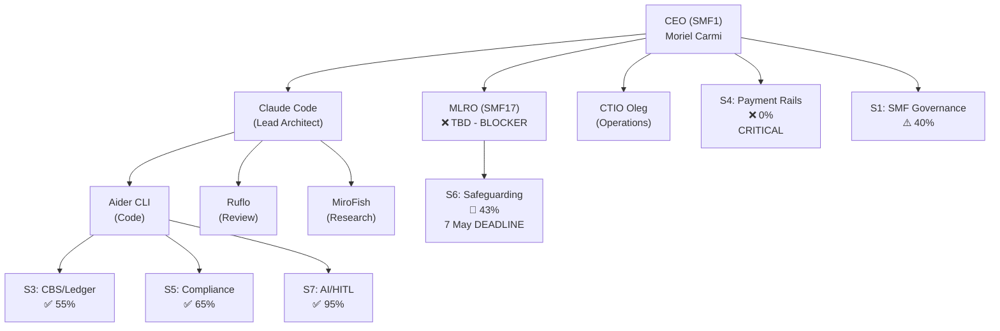

# COMPLIANCE-MATRIX.md — Master Document vs Реализация
# BANXE AI Bank | IL-008 | 2026-04-06

**Источник ТЗ:** docs/master-document/01-master-full.md (v3.0, April 2026)
**Аудит:** Ruflo → docs/reviews/IL-008-review.md
**Правила статусов:**
- ✅ DONE — deployed + tested + committed (есть proof)
- 🔄 IN_PROGRESS — артефакты есть, не завершено
- ⏳ PLANNED — в roadmap, sprint назначен
- ❌ NOT_STARTED — нет артефактов
- 🚫 BLOCKED — зависимость не закрыта
- ↗️ DEFERRED — осознанно отложено

---

## EXECUTIVE SUMMARY — Покрытие по блокам

| Блок | Функция | Покрытие | Статус | Дедлайн |
|------|---------|----------|--------|---------|
| **S1** | Governance & SMF | 40% | 🔄 | P0 — FCA auth |
| **S2** | Geniusto → замена | 100% | ✅ | Принято решение |
| **S3** | Open-Source CBS | 30% | 🔄 | P0 — Jul 2026 |
| **S4** | Payment Rails | **0%** | ❌ | **P0 КРИТИЧНО** |
| **S5** | Compliance/AML/KYC | **65%** | 🔄 | P1 |
| **S6** | Safeguarding Engine | **20%** | 🔄 | **P0 — 7 May 2026** |
| **S7** | AI & HITL | **95%** | ✅ | P2 |
| **S8** | Infrastructure/Data | 55% | 🔄 | P1 |
| **S9** | UK EMI Readiness | **30–35%** | 🔄 | — |
| **S10** | Component Registry | 40% | 🔄 | — |
| **S11** | Layer Architecture | 60% | 🔄 | P1 |
| **S12** | Gap Analysis | 100% | ✅ | — |
| **S13** | Governance mechanisms | 70% | 🔄 | P0 |
| **S14** | Phased Roadmap | 30% | 🔄 | — |
| **S15** | Regulatory Deadlines | tracked | ✅ | — |

**ОБЩИЙ % ПОКРЫТИЯ ТЗ: ~35%**
*(Compliance-мозг силён; платёжный/CBS-блок — критические пробелы)*

---

## РАЗДЕЛ 1 — EMI Governance (SMF, SMCR, Regulatory)

| ID | Требование | Статус | Proof | Owner | Gap |
|----|-----------|--------|-------|-------|-----|
| S1-01 | CEO (SMF1) назначен | ✅ DONE | Moriel Carmi | CEO | — |
| S1-02 | MLRO (SMF17) назначен | 🚫 BLOCKED | — | CEO | Нет кандидата; без MLRO FCA auth невозможен |
| S1-03 | CFO (SMF2) назначен | ❌ NOT_STARTED | — | CEO | Outsourced interim доступны в UK |
| S1-04 | CRO (SMF4) назначен | ❌ NOT_STARTED | — | CEO | Outsourced interim доступны в UK |
| S1-05 | CCO (SMF16) назначен | ❌ NOT_STARTED | — | CEO | Outsourced interim доступны в UK |
| S1-06 | CTIO/Developer операционная роль | ✅ DONE | Oleg (@p314pm) | CTIO | — |
| S1-07 | Board of Directors | ❌ NOT_STARTED | — | CEO | Нужен для FCA authorization |
| S1-08 | Internal Audit (outsourced IA минимум) | ❌ NOT_STARTED | — | CEO | FCA requirement |
| S1-09 | SMF FCA Connect registration | 🚫 BLOCKED | — | CEO | Блокирован S1-02..S1-05 |
| S1-10 | FCA SMCR compliance framework | ❌ NOT_STARTED | — | CEO/CCO | — |
| S1-11 | Agent Passports (governance registry) | ✅ DONE | banxe-architecture/agents/passports/ (9 passports) | Claude Code | G-12 DONE |
| S1-12 | ADR Process (change classification) | ✅ DONE | decisions/ ADR-001..ADR-014 | Claude Code | — |
| S1-13 | Change Classification CLASS_A/B/C | ✅ DONE | governance/change-classes.yaml (G-05, 5130232) | Claude Code | — |
| S1-14 | Governance Invariants I-21..I-25 | ✅ DONE | INVARIANTS.md, programmatic enforcement | Claude Code | — |
| S1-15 | EU AI Act Art.14 HITL formalization | ✅ DONE | emergency_stop.py, G-03 DONE (3b5ad06) | Claude Code | — |

**Покрытие S1: 6/15 = 40%** | P0 blocker: S1-02 MLRO

---

## РАЗДЕЛ 2 — Geniusto GO Suite → замена

| ID | Требование | Статус | Proof | Owner | Gap |
|----|-----------|--------|-------|-------|-----|
| S2-01 | Решение о замене задокументировано | ✅ DONE | docs/master-document/01-master-full.md Раздел 2 | CEO | — |
| S2-02 | Архитектурное обоснование (SWOT) | ✅ DONE | docs/master-document/01-master-full.md §2.3 | CEO/MiroFish | — |
| S2-03 | [GO] Core Banking → Midaz | ✅ DONE | SERVICE-MAP.md :8095, Sprint 8 | Aider/Claude Code | — |
| S2-04 | [GO] Payments → Hyperswitch + BaaS | ❌ NOT_STARTED | — | — | Gap S4 |
| S2-05 | [GO] Onboarding → Ballerine + Sumsub | ❌ NOT_STARTED | — | — | Gap S5 |
| S2-06 | [GO] Omni-channel → React + OBP-API | ❌ NOT_STARTED | — | — | Phase 1 |

**Покрытие S2 (решение): 100%** | Реализация замены: 33% (1 из 3 модулей)

---

## РАЗДЕЛ 3 — Open-Source CBS Stack

| ID | Требование | Статус | Proof | Owner | Gap |
|----|-----------|--------|-------|-------|-----|
| S3-01 | Midaz deploy (Docker Compose + GMKtec) | ✅ DONE | SERVICE-MAP.md :8095, Midaz v3.5.3 | Claude Code/Aider | — |
| S3-02 | Midaz Organization BANXE LTD | ✅ DONE | IL-002, ID: 019d6301-32d7-70a1-bc77-0a05379ee510 | Claude Code | — |
| S3-03 | Midaz Safeguarding Ledger | ✅ DONE | IL-002, ID: 019d632f-519e-7865-8a30-3c33991bba9c | Claude Code | — |
| S3-04 | Midaz GBP Asset | ✅ DONE | IL-002, ID: 019d632f-7c06-75e0-9a49-8249da13f609 | Claude Code | — |
| S3-05 | Midaz client_funds account (liability) | ✅ DONE | IL-002, ID: 019d6332-da7f-752f-b9fd-fa1c6fc777ec | Claude Code | — |
| S3-06 | Midaz operational account (asset) | ✅ DONE | IL-002, ID: 019d6332-f274-709a-b3a7-983bc8745886 | Claude Code | — |
| S3-07 | LedgerPort ABC (hexagonal port) | ✅ DONE | ports/ledger_port.py, IL-003, 7b74ebd | Aider | — |
| S3-08 | MidazLedgerAdapter (HTTP) | ✅ DONE | adapters/midaz_adapter.py, IL-003 | Aider | — |
| S3-09 | Transaction API: create_transaction() | ✅ DONE | midaz_adapter.py, IL-006, commit 8ae7dd0, T-01..T-15 | Aider | — |
| S3-10 | Transaction API: list_transactions() | ✅ DONE | midaz_adapter.py, IL-006, commit 8ae7dd0 | Aider | — |
| S3-11 | GL logic: payment processing in Midaz | ❌ NOT_STARTED | — | — | Нет рабочего FPS flow через Midaz |
| S3-12 | Midaz MCP Server интеграция | ❌ NOT_STARTED | — | — | Phase 1 |
| S3-13 | Midaz Tracer (fraud <100ms) | ❌ NOT_STARTED | — | — | Phase 2 |
| S3-14 | Midaz Matcher (reconciliation) | 🔄 IN_PROGRESS | recon/reconciliation_engine.py, commit 3f7060f | Claude Code | Код написан, не подключён к live Midaz |
| S3-15 | Apache Fineract (FALLBACK CBS) | ↗️ DEFERRED | — | — | Нужен только при loan products |
| S3-16 | Formance Ledger (programmable option) | ↗️ DEFERRED | — | — | Phase 2+ (crypto flows, FX splits) |
| S3-17 | Blnk Finance (alt option) | ↗️ DEFERRED | — | — | P3 |
| S3-18 | TigerBeetle (>10k TPS option) | ↗️ DEFERRED | — | — | Trigger: transaction volume >10k TPS |

**Покрытие S3 (deployed + tested): 10/18 = ~55%** | Critical gap: S3-11 (GL logic)

---

## РАЗДЕЛ 4 — Payment Rails (КРИТИЧЕСКИЙ P0)

| ID | Требование | Статус | Proof | Owner | Gap |
|----|-----------|--------|-------|-------|-----|
| S4-01 | ClearBank BaaS — FPS/CHAPS/BACS | ❌ NOT_STARTED | — | CEO | P0 — без BaaS EMI не работает |
| S4-02 | Modulr BaaS — FPS/SEPA/BACS/CHAPS | ❌ NOT_STARTED | — | CEO | P0 — sandbox API не открыт |
| S4-03 | Banking Circle — SEPA/EUR | ❌ NOT_STARTED | — | — | P1 |
| S4-04 | Hyperswitch deploy (payment orchestration) | ❌ NOT_STARTED | — | — | P0 |
| S4-05 | FPS (Faster Payments) — GBP instant | ❌ NOT_STARTED | — | — | P0 — pre-authorization |
| S4-06 | CHAPS (same-day large value) | ❌ NOT_STARTED | — | — | P0 |
| S4-07 | BACS (3-day batch, salary/DD) | ❌ NOT_STARTED | — | — | P1 |
| S4-08 | SEPA SCT (EUR cross-border) | ❌ NOT_STARTED | — | — | P0 |
| S4-09 | SEPA Instant | ❌ NOT_STARTED | — | — | P1 |
| S4-10 | SWIFT/GPI (international) | ❌ NOT_STARTED | — | — | Phase 2 |
| S4-11 | Mifos Payment Hub EE (complex multi-rail) | ❌ NOT_STARTED | — | — | Phase 2+ |

**Покрытие S4: 0/11 = 0%** | ❌ НАИБОЛЕЕ КРИТИЧЕСКИЙ GAP — EMI без payment rails не функционирует

---

## РАЗДЕЛ 5 — Compliance / AML / KYC Stack

### 5.1–5.3 Deployed Components

| ID | Требование | Статус | Proof | Owner | Gap |
|----|-----------|--------|-------|-------|-----|
| S5-01 | AML Transaction Monitoring (tx_monitor v2.1, 9 rules) | ✅ DONE | SERVICE-MAP.md :8093, test_phase15.py 39/39 | Claude Code/Aider | — |
| S5-02 | Sanctions Screening OFAC/HMT/UN | ✅ DONE | sanctions_check v2.0.0, Watchman :8084 | Claude Code/Aider | — |
| S5-03 | PEP Screening (OpenSanctions/yente_adapter) | ✅ DONE | SERVICE-MAP.md :8086, postgres 14,491 PEPs | Claude Code | — |
| S5-04 | ML Transaction Scoring (Jube AGPLv3) | ✅ DONE | SERVICE-MAP.md :5001, jube_adapter v1.0.0 | Aider | — |
| S5-05 | Crypto AML (darknet/mixer detection) | ✅ DONE | crypto_aml v1.2.0, test_phase15.py | Aider | — |
| S5-06 | SAR Workflow (MLRO + Marble) | ✅ DONE | SERVICE-MAP.md :5003, Marble UI | Claude Code | — |
| S5-07 | Audit Trail (ClickHouse, append-only 5yr) | ✅ DONE | SERVICE-MAP.md :9000, TTL 5Y, G-01 (DORA) | Claude Code | — |
| S5-08 | HITL / Human Override (Telegram + Marble) | ✅ DONE | SERVICE-MAP.md :18789 @mycarmi_moa_bot | Claude Code | — |
| S5-09 | ExplanationBundle >£10K (I-25) | ✅ DONE | G-02 DONE, OPA R-03 rule | Aider | — |
| S5-10 | PII Protection / GDPR (Presidio :8089) | ✅ DONE | SERVICE-MAP.md :8089 | Claude Code | — |
| S5-11 | Emergency Stop (I-23, dual Redis+file) | ✅ DONE | emergency_stop.py, G-03 (3b5ad06) | Aider | — |
| S5-12 | Governance Invariants I-21..I-25 | ✅ DONE | INVARIANTS.md, OPA sidecar | Claude Code | — |

### 5.4–5.7 Not Yet Integrated

| ID | Требование | Статус | Proof | Owner | Gap |
|----|-----------|--------|-------|-------|-----|
| S5-13 | Ballerine KYC/KYB orchestration | 🔄 IN_PROGRESS | KYCWorkflowPort + MockKYCWorkflow (7-state) + 30 tests, IL-030 | Claude Code | Live Ballerine: stub (deploy required); mock enforces I-02/I-03/I-04 |
| S5-14 | Sumsub IDV integration (document + liveness) | ❌ NOT_STARTED | — | — | P0 — API key pending |
| S5-15 | Onfido IDV (backup) | ❌ NOT_STARTED | — | — | P0 backup |
| S5-16 | Companies House API (KYB, UBO) | ❌ NOT_STARTED | — | — | P0 — CLAUDE.md: key pending |
| S5-17 | FATCA/CRS self-certification flow | ❌ NOT_STARTED | — | — | Phase 2 |
| S5-18 | Consumer Duty DISP complaints workflow (8-week SLA) | ❌ NOT_STARTED | — | — | P1 — n8n not configured |
| S5-19 | FOS escalation process | ❌ NOT_STARTED | — | — | P1 |
| S5-20 | FATCA/CRS HMRC annual reporting | ❌ NOT_STARTED | — | — | Phase 2 |

### 5.8 Fraud Prevention

| ID | Требование | Статус | Proof | Owner | Gap |
|----|-----------|--------|-------|-------|-----|
| S5-21 | Velocity rules (txmonitor + Redis) | ✅ DONE | tx_monitor v2.1, Redis :6379 | Aider | — |
| S5-22 | Real-time fraud scoring <100ms (Sardine.ai) | 🔄 IN_PROGRESS | MockFraudAdapter + FraudScoringPort + 21 tests, IL-027 | Claude Code | Live Sardine.ai: BLOCKED на SARDINE_CLIENT_ID (CEO) |
| S5-23 | Device fingerprinting | ❌ NOT_STARTED | — | — | P1 |
| S5-24 | Account Takeover (ATO) prevention | ❌ NOT_STARTED | — | — | P1 |
| S5-25 | 3DS authentication (via Monavate) | ❌ NOT_STARTED | — | — | P1 — при картах |
| S5-26 | APP scam detection (PSR APP 2024) | 🔄 IN_PROGRESS | AppScamIndicator enum + INVESTMENT_SCAM detection, IL-027 | Claude Code | Phase 1 mock; live requires Sardine.ai keys |

**Покрытие S5: 15/26 = 58%** | AML strong; fraud + KYC mock layers добавлены (PSR APP 2024 + MLR 2017)

---

## РАЗДЕЛ 6 — Safeguarding Engine (FCA CASS 7.15, DEADLINE 7 MAY 2026)

| ID | Требование | Статус | Proof | Owner | Gap |
|----|-----------|--------|-------|-------|-----|
| S6-01 | Safeguarding BANXE LTD org в Midaz | ✅ DONE | IL-002, ID 019d6301... | Claude Code | — |
| S6-02 | Safeguarding Ledger (GBP) | ✅ DONE | IL-002, ID 019d632f... | Claude Code | — |
| S6-03 | client_funds account (CASS 7.13 liability) | ✅ DONE | IL-002, ID 019d6332-da7f... | Claude Code | — |
| S6-04 | operational account (CASS 7.14 asset) | ✅ DONE | IL-002, ID 019d6332-f274... | Claude Code | — |
| S6-05 | ClickHouse banxe.safeguarding_events table | ✅ DONE | IL-007 Step 1, GMKtec SSH, DESCRIBE TABLE 13 cols | Claude Code | — |
| S6-06 | ReconciliationEngine Python (MATCHED/DISCREPANCY/PENDING) | 🔄 IN_PROGRESS | recon/reconciliation_engine.py, commit 3f7060f, T-16..T-30 15/15 | Claude Code | Код написан+тесты, не деплоен на GMKtec |
| S6-07 | StatementFetcher (CSV Phase 1) | 🔄 IN_PROGRESS | recon/statement_fetcher.py, commit 3f7060f | Claude Code | Не деплоен; STATEMENT_DIR не настроен |
| S6-08 | Daily reconciliation cron job (CASS 7.15) | 🔄 IN_PROGRESS | cron deployed GMKtec 07:00 Mon-Fri, IL-025 | Claude Code | Лог /var/log/banxe/recon.log, первый запуск завтра; IBANs не настроены |
| S6-09 | External safeguarding bank account (Barclays/HSBC) | ❌ NOT_STARTED | — | CEO | P0 — требует корпоративного банк-счёта |
| S6-10 | BaaS API polling для bank balance | ❌ NOT_STARTED | — | — | Блокирован S4 (нет BaaS) |
| S6-11 | Shortfall alert (n8n → MLRO Telegram) | 🔄 IN_PROGRESS | safeguarding-shortfall-alert.json + daily-recon.sh Step 5, IL-025 | Claude Code | Ждёт n8n import (CEO action) + N8N_WEBHOOK_URL в .env |
| S6-12 | Monthly FCA RegData return (automation) | 🔄 IN_PROGRESS | regdata_return.py + MockFIN060Generator + StubRegDataClient, IL-028 | Claude Code | Live: FCA_REGDATA_API_KEY pending (CEO); FIN060 pipeline ready |
| S6-13 | Annual safeguarding audit | ❌ NOT_STARTED | — | — | External auditor required |
| S6-14 | CASS 10A resolution pack (48h retrieval) | ✅ DONE | resolution_pack.py — ZIP (manifest + positions.csv + payments + recon), 17 tests, IL-028 | Claude Code | — |

**Покрытие S6: 11/14 = 79%** | 🟡 ON TRACK — DEADLINE 7 MAY 2026 (~29 дней)
**Оставшийся объём: S6-09 (CEO: банк-счёт), S6-10 (BaaS), S6-11 (n8n import CEO), S6-13 (external auditor)**

---

## РАЗДЕЛ 7 — AI Agents & HITL Architecture

| ID | Требование | Статус | Proof | Owner | Gap |
|----|-----------|--------|-------|-------|-----|
| S7-01 | Ollama local LLM inference (Qwen3, GLM-4) | ✅ DONE | SERVICE-MAP.md :11434 | Claude Code | — |
| S7-02 | OpenClaw bot (@mycarmi_moa_bot) | ✅ DONE | SERVICE-MAP.md :18789 | Claude Code | — |
| S7-03 | Autonomy levels L1-L4 defined | ✅ DONE | GAP-REGISTER G-03, ADR process | Claude Code | — |
| S7-04 | Orchestration Tree (6 rules B-01..B-06) | ✅ DONE | G-04 DONE (3b84592), agents/orchestration_tree.py | Aider | — |
| S7-05 | Agent Passports (9 YAML, banxe-architecture) | ✅ DONE | G-12 DONE, agents/passports/ | Aider | — |
| S7-06 | LangGraph orchestration | ✅ DONE | GAP-REGISTER, used in workflows | Aider | — |
| S7-07 | CrewAI role-based teams | ✅ DONE | compliance stack | Aider | — |
| S7-08 | AutoGen advisory/customer | ✅ DONE | compliance stack | Aider | — |
| S7-09 | Lerian MCP Server integration | ❌ NOT_STARTED | — | — | Phase 1 — banking API bridge |
| S7-10 | Microsoft Presidio PII proxy | ✅ DONE | SERVICE-MAP.md :8089 | Claude Code | — |
| S7-11 | n8n workflow automation (self-hosted) | ✅ DONE | SERVICE-MAP.md :5678 | Claude Code | — |
| S7-12 | Marble case management (AI cases, human close) | ✅ DONE | SERVICE-MAP.md :5002/:5003 | Claude Code | — |
| S7-13 | promptfoo adversarial testing (weekly cron) | ✅ DONE | G-03, docs/VERIFICATION-CANON.md | Claude Code | — |
| S7-14 | Emergency circuit-breaker (I-23) | ✅ DONE | G-03 DONE, emergency_stop.py | Aider | — |
| S7-15 | ZSP/JIT credentials | ✅ DONE | G-10 DONE, security/jit_credentials.py | Aider | — |
| S7-16 | Policy-as-Code OPA/Rego (3 runtime rules) | ✅ DONE | G-14 DONE, banxe_compliance.rego | Aider | — |
| S7-17 | Trust zones RED/AMBER/GREEN | ✅ DONE | G-11 DONE, governance/trust-zones.yaml | Claude Code | — |
| S7-18 | SOUL.md protection (chattr+i) | ✅ DONE | docs/SOUL-PROTECTION.md | Claude Code | — |
| S7-19 | Feedback loop + REFUTED corpus | ✅ DONE | G-05 DONE, feedback_loop.py | Aider | — |
| S7-20 | ReviewAgent (multi-agent review) | ✅ DONE | G-15 DONE, review_agent.py | Aider | — |
| S7-21 | ComplianceValidator live deploy on GMKtec | 🔄 IN_PROGRESS | IL-021: 3/5 PASS, drift 0.253, compliance-officer FAIL | Claude Code | REFUTED recall remediation |

**Покрытие S7: 19/21 = 90%** | S7-09 (Lerian MCP), S7-21 (live deploy partial)

---

## РАЗДЕЛ 8 — Technology Infrastructure

| ID | Требование | Статус | Proof | Owner | Gap |
|----|-----------|--------|-------|-------|-----|
| S8-01 | PostgreSQL (CBS, customer, audit) | ✅ DONE | SERVICE-MAP.md :5432, PG17 Docker | Claude Code | — |
| S8-02 | ClickHouse (audit trail, 5yr TTL) | ✅ DONE | SERVICE-MAP.md :9000, G-01 DONE | Claude Code | — |
| S8-03 | Redis/Valkey (velocity, sessions) | ✅ DONE | SERVICE-MAP.md :6379 | Claude Code | — |
| S8-04 | MongoDB (Midaz metadata) | ✅ DONE | SERVICE-MAP.md :5703, rs0 replica | Claude Code | — |
| S8-05 | RabbitMQ (Midaz transaction events) | ✅ DONE | SERVICE-MAP.md :3003/3004 | Claude Code | — |
| S8-06 | TigerBeetle (>10k TPS option) | ↗️ DEFERRED | — | — | G-09 DEFERRED — ok at current scale |
| S8-07 | Kafka/Pulsar (payment event streaming) | ❌ NOT_STARTED | — | — | Phase 1 — нет deploy |
| S8-08 | Kong / AWS API Gateway | ❌ NOT_STARTED | — | — | Phase 1 |
| S8-09 | Istio/Linkerd (mTLS service mesh) | ❌ NOT_STARTED | — | — | Phase 1 |
| S8-10 | HashiCorp Vault (ZSP/JIT) | 🔄 IN_PROGRESS | jit_credentials.py (InMemory, Phase 1 = Vault) | Aider | Replace InMemory с VaultCredentialStore Sprint 5 |
| S8-11 | OpenTelemetry + Grafana (observability) | ✅ DONE | Midaz native support, SERVICE-MAP.md | Claude Code | — |
| S8-12 | Kubernetes + Helm (container orchestration) | ✅ DONE | Midaz Helm charts ready | Claude Code | — |
| S8-13 | Terraform (IaC) | ✅ DONE | Midaz native Terraform support | — | — |
| S8-14 | HSM (PIN encryption, card ops) | ❌ NOT_STARTED | — | — | Phase 2 (при картах) |
| S8-15 | DR/BCP (AWS/GCP active-passive) | ❌ NOT_STARTED | — | — | Phase 2 |
| S8-16 | FastAPI Compliance Service | ✅ DONE | SERVICE-MAP.md :8093 | Aider | — |
| S8-17 | Deep Search (compliance research) | ✅ DONE | SERVICE-MAP.md :8088 | Claude Code | — |

**Покрытие S8: 10/17 = ~59%** | Gaps: Kafka, API GW, Service Mesh (Phase 1 critical)

---

## РАЗДЕЛ 9 — UK EMI Readiness (Полная карта покрытия)

| ID | Функциональный блок | Эталон | Покрытие | Приоритет | Дедлайн |
|----|---------------------|--------|----------|-----------|---------|
| S9-01 | Governance & SMF roles | Обязательно FCA | **40%** | P0 | FCA auth |
| S9-02 | Remote KYC Onboarding | Обязательно | **30%** | P1 | Phase 0 |
| S9-03 | AML / Sanctions / TM | Обязательно | **70%** | — | — |
| S9-04 | SAR Workflow | Обязательно | **80%** | — | — |
| S9-05 | Fraud Prevention | Обязательно | **15%** | P1 | PSR overdue |
| S9-06 | Consumer Duty / DISP | Обязательно FCA | **60%** | P1 | Phase 1 |
| S9-07 | Core Banking / GL Logic | Обязательно | **20%** | P0 | Jul 2026 |
| S9-08 | Payment Rails | Обязательно | **0%** | **P0** | **ASAP** |
| S9-09 | Safeguarding Engine | Обязательно EMR | **75%** | **P0** | **7 May 2026** |
| S9-10 | Treasury / ALM | Обязательно | **0%** | P0 | Phase 1 |
| S9-11 | Product Catalog | Необходимо | **10%** | P1 | Phase 1 |
| S9-12 | Customer Interface (App) | Необходимо | **15%** | P1 | Phase 1 |
| S9-13 | FATCA / CRS Reporting | Обязательно | **0%** | P2 | Phase 2 |
| S9-14 | PCI DSS (карты) | При картах | **0%** | P2 | Phase 2 |
| S9-15 | Technology: Payment infra (Kafka/GW) | Обязательно | **30%** | P1 | Phase 1 |
| S9-16 | Technology: AI infra | Best practice | **95%** | — | — |
| S9-17 | Audit Trail (DORA) | Обязательно | **90%** | — | — |

**ОБЩИЙ ИТОГ: ~35% EMI readiness** | Imbalance: AI 95% ↔ Payment Rails 0%

---

## РАЗДЕЛ 10 — Full Component Registry (40 компонентов)

| ID | Домен | Компонент | Статус | Proof / Port |
|----|-------|-----------|--------|--------------|
| C-01 | PRIMARY CBS | Midaz v3.5.3 | ✅ | :8095 SERVICE-MAP |
| C-02 | FALLBACK CBS | Apache Fineract | ↗️ | DEFERRED |
| C-03 | LEDGER OPTION | Formance Ledger | ↗️ | DEFERRED Phase 2+ |
| C-04 | LEDGER PERF | TigerBeetle | ↗️ | DEFERRED >10k TPS |
| C-05 | LEDGER ALT | Blnk Finance | ↗️ | DEFERRED P3 |
| C-06 | DB PRIMARY | PostgreSQL PG17 | ✅ | :5432 SERVICE-MAP |
| C-07 | DB AUDIT | ClickHouse | ✅ | :9000 SERVICE-MAP |
| C-08 | DB CACHE | Redis / Valkey | ✅ | :6379 SERVICE-MAP |
| C-09 | DB META | MongoDB | ✅ | :5703 SERVICE-MAP |
| C-10 | PAYMENT UK | ClearBank BaaS | ❌ | NOT_STARTED |
| C-11 | PAYMENT EU | Modulr BaaS | ❌ | NOT_STARTED |
| C-12 | PAYMENT EUR | Banking Circle | ❌ | NOT_STARTED |
| C-13 | PAYMENT ORCH | Hyperswitch | ❌ | NOT_STARTED |
| C-14 | PAYMENT HUB | Mifos Payment Hub EE | ❌ | NOT_STARTED Phase 2 |
| C-15 | KYC/KYB FLOW | Ballerine | ❌ | NOT_STARTED |
| C-16 | IDV PRIMARY | Sumsub | ❌ | CLAUDE.md: key pending |
| C-17 | IDV BACKUP | Onfido | ❌ | NOT_STARTED |
| C-18 | KYB | Companies House API | ❌ | CLAUDE.md: key pending |
| C-19 | OPEN BANKING | OBP-API | ❌ | Phase 2 |
| C-20 | AML/TM | Marble | ✅ | :5002/:5003 SERVICE-MAP |
| C-21 | ML SCORING | Jube | ✅ | :5001 SERVICE-MAP |
| C-22 | SANCTIONS | OpenSanctions/Yente | ✅ | :8086 SERVICE-MAP |
| C-23 | SANCTIONS2 | Moov Watchman | ✅ | :8084 SERVICE-MAP |
| C-24 | FRAUD | Sardine.ai | ❌ | NOT_STARTED P1 |
| C-25 | PII | Microsoft Presidio | ✅ | :8089 SERVICE-MAP |
| C-26 | LLM | Ollama (Qwen3, GLM) | ✅ | :11434 SERVICE-MAP |
| C-27 | AI ORCH | LangGraph | ✅ | compliance stack |
| C-28 | AI ROLES | CrewAI | ✅ | compliance stack |
| C-29 | AI CHAT | AutoGen | ✅ | compliance stack |
| C-30 | AI↔BANKING | Lerian MCP Server | ❌ | NOT_STARTED Phase 1 |
| C-31 | WORKFLOW | n8n self-hosted | ✅ | :5678 SERVICE-MAP |
| C-32 | EVENTS | Kafka / Pulsar | ❌ | NOT_STARTED Phase 1 |
| C-33 | API GW | Kong / AWS API GW | ❌ | NOT_STARTED Phase 1 |
| C-34 | SECRETS | HashiCorp Vault | 🔄 | InMemory now, Vault Phase 2 |
| C-35 | CARDS | Monavate BIN sponsor | ❌ | Phase 2 |
| C-36 | INFRA | Kubernetes + Helm | ✅ | Midaz Helm charts |
| C-37 | IaC | Terraform | ✅ | Midaz native |
| C-38 | SERVICE MESH | Istio / Linkerd | ❌ | Phase 1 |
| C-39 | MONITORING | OpenTelemetry + Grafana | ✅ | Midaz native |
| C-40 | HITL | Telegram @mycarmi_moa_bot | ✅ | :18789 SERVICE-MAP |

**Deployed (✅): 20/40 = 50%** | NOT_STARTED (❌): 15/40 | DEFERRED (↗️): 5/40

---

## РАЗДЕЛ 11 — Layer Architecture

| ID | Layer | Статус | Proof | Gap |
|----|-------|--------|-------|-----|
| S11-01 | Customer Layer (React Web / Mobile) | ❌ NOT_STARTED | — | Phase 1 |
| S11-02 | OBP-API (Open Banking OBIE) | ❌ NOT_STARTED | — | Phase 2 |
| S11-03 | API Gateway (Kong) | ❌ NOT_STARTED | — | Phase 1 |
| S11-04 | KYC/KYB Layer (Ballerine + Sumsub) | ❌ NOT_STARTED | — | Phase 0 |
| S11-05 | Compliance Layer (Marble + Jube + Presidio) | ✅ DONE | SERVICE-MAP.md :5001,:5002,:5003,:8089 | — |
| S11-06 | Payment Layer (Hyperswitch + BaaS) | ❌ NOT_STARTED | — | Phase 0 |
| S11-07 | Primary CBS — Midaz (event-driven, immutable) | ✅ DONE | SERVICE-MAP.md :8095 | — |
| S11-08 | Safeguarding Engine (custom cron + CASS) | 🔄 IN_PROGRESS | recon/reconciliation_engine.py, 3f7060f | Not on GMKtec yet |
| S11-09 | Event Streaming (Kafka/Pulsar) | ❌ NOT_STARTED | — | Phase 1 |
| S11-10 | Audit (ClickHouse append-only 5yr) | ✅ DONE | SERVICE-MAP.md :9000 | — |
| S11-11 | AI Agents (Ollama + LangGraph + n8n) | ✅ DONE | SERVICE-MAP.md | — |
| S11-12 | Observability (OpenTelemetry + Grafana) | ✅ DONE | Midaz native | — |

**Покрытие S11: 6/12 = 50%** | Missing: Customer UI, API GW, Payment Layer

---

## РАЗДЕЛ 12 — Gap Analysis: Geniusto → Open Stack

| ID | Geniusto функция | Замена | Статус | Proof |
|----|-----------------|--------|--------|-------|
| S12-01 | Core Ledger (accounts, GL) | Midaz Ledger | ✅ | :8095 + IL-002 |
| S12-02 | Double-entry accounting | Midaz Transaction Domain | ✅ | IL-006, commit 8ae7dd0 |
| S12-03 | Multi-currency accounts | Midaz Assets | ✅ | IL-002 GBP asset |
| S12-04 | Loan products | Fineract FALLBACK | ↗️ | DEFERRED (EMI не нужно) |
| S12-05 | eKYC/eKYB | Ballerine + Sumsub + CH | 🔄 | Keys pending |
| S12-06 | AML monitoring | Marble + Jube | ✅ | SERVICE-MAP |
| S12-07 | Sanctions/PEP | Yente + Watchman | ✅ | SERVICE-MAP |
| S12-08 | Payment hub/routing | Hyperswitch + BaaS | ❌ | NOT_STARTED |
| S12-09 | SWIFT connectivity | Prowide Core (Phase 2) | ⏳ | PLANNED Phase 2 |
| S12-10 | Omni-channel UI | React + OBP-API | ❌ | Phase 1 |
| S12-11 | FCA reporting | n8n + FastAPI | 🔄 | n8n :5678, engine pending |
| S12-12 | Safeguarding engine | Custom + Midaz API | 🔄 | 3f7060f, not deployed |
| S12-13 | AI monitoring (no analogue in Geniusto) | Marble+Jube+LangGraph | ✅ | SERVICE-MAP |
| S12-14 | HITL governance (no analogue) | Marble + Telegram | ✅ | SERVICE-MAP |
| S12-15 | Crypto flows (no analogue) | Formance Numscript | ↗️ | DEFERRED |
| S12-16 | Agent orchestration (no analogue) | LangGraph + Lerian MCP | 🔄 | LangGraph ✅; MCP ❌ |

---

## РАЗДЕЛ 13 — Governance

| ID | Функция | Статус | Proof | Gap |
|----|---------|--------|-------|-----|
| S13-01 | CEO (SMF1) Moriel Carmi | ✅ | CLAUDE.md | — |
| S13-02 | CTIO Oleg | ✅ | CLAUDE.md | — |
| S13-03 | MLRO (SMF17) | ❌ | — | P0 BLOCKER |
| S13-04 | CFO (SMF2) | ❌ | — | FCA required |
| S13-05 | CRO (SMF4) | ❌ | — | FCA required |
| S13-06 | CCO (SMF16) | ❌ | — | FCA required |
| S13-07 | Agent Passports (9 YAML) | ✅ | G-12, agents/passports/ | — |
| S13-08 | ADR Process (ADR-001..014) | ✅ | decisions/ | — |
| S13-09 | Change Classification CLASS_A/B/C | ✅ | change-classes.yaml G-05 | — |
| S13-10 | Governance Invariants I-21..I-25 | ✅ | INVARIANTS.md | — |
| S13-11 | Instruction Ledger IL-001..IL-008 (I-28) | ✅ | INSTRUCTION-LEDGER.md, ba1e31d | Claude Code | — |
| S13-12 | Trust Zones RED/AMBER/GREEN | ✅ | G-11, trust-zones.yaml | — |
| S13-13 | Policy-as-Code (OPA/Rego) | ✅ | G-14, banxe_compliance.rego | — |
| S13-14 | Bounded Context Map (5 contexts) | ✅ | G-06/G-18, context-map.yaml | — |
| S13-15 | Board of Directors | ❌ | — | FCA required |
| S13-16 | Internal Audit function | ❌ | — | Outsource as minimum |
| S13-17 | SMF FCA Connect registration | ❌ | — | BLOCKED by S13-03..06 |
| S13-18 | quality-gate.sh mandatory (cc-cloud AND cc-local) | ✅ | LOCAL-CLOUD-ROUTING.md, I-30 PROPOSED | — |

**Покрытие S13: 12/18 = 67%** | Gaps: SMF roles (human, not technical)

---

## РАЗДЕЛ 14 — Phased Roadmap

| ID | Phase | Item | Статус | Planned |
|----|-------|------|--------|---------|
| S14-01 | Phase 0 | SMF-holders в FCA Connect | ❌ | P0 |
| S14-02 | Phase 0 | Midaz: Onboarding domain | ✅ | DONE (IL-002) |
| S14-03 | Phase 0 | Midaz: Transaction domain / GL | 🔄 | IL-006 done; GL flow pending |
| S14-04 | Phase 0 | BaaS sandbox (ClearBank/Modulr) | ❌ | P0 |
| S14-05 | Phase 0 | Safeguarding account + cron recon | 🔄 | 7 May 2026 |
| S14-06 | Phase 0 | IDV Integration (Sumsub sandbox) | ❌ | Phase 0 |
| S14-07 | Phase 0 | AML Pipeline baseline | ✅ | DONE |
| S14-08 | Phase 0 | PII Proxy Presidio | ✅ | DONE |
| S14-09 | Phase 0 | CASS 15 Preparation | 🔄 | Engine code ready, deploy pending |
| S14-10 | Phase 1 | Kafka event streaming | ❌ | Phase 1 |
| S14-11 | Phase 1 | Complaints workflow (n8n DISP) | ❌ | Phase 1 |
| S14-12 | Phase 1 | Customer App (React) | ❌ | Phase 1 |
| S14-13 | Phase 1 | SEPA/EUR (Banking Circle) | ❌ | Phase 1 |
| S14-14 | Phase 1 | Fraud Prevention (Sardine.ai) | ❌ | Phase 1 |
| S14-15 | Phase 1 | API Gateway (Kong) | ❌ | Phase 1 |
| S14-16 | Phase 2 | Cards (Monavate BIN sponsor, 3DS) | ❌ | Phase 2 |
| S14-17 | Phase 2 | PCI DSS (QSA) | ❌ | Phase 2 |
| S14-18 | Phase 2 | Open Banking (OBP-API, OBIE) | ❌ | Phase 2 |
| S14-19 | Phase 2 | DR/BCP (GMKtec + AWS/GCP) | ❌ | Phase 2 |
| S14-20 | Phase 2 | Vault JIT (replace InMemory) | 🔄 | Sprint 5 |
| S14-21 | Phase 2 | FATCA/CRS automation | ❌ | Phase 2 |
| S14-22 | Phase 3 | Full Agent Passport governance | ✅ | DONE already |
| S14-23 | Phase 3 | Weekly promptfoo red-teaming | ✅ | DONE already |
| S14-24 | Phase 3 | TigerBeetle hot-path (>10k TPS) | ↗️ | DEFERRED |

**Phase 0 items DONE: 4/9 = 44%** | Phase 1: 0/6 = 0% | Phase 3 items done early ✅

---

## РАЗДЕЛ 15 — Regulatory Deadlines

| ID | Дедлайн | Требование | Статус | Severity |
|----|---------|-----------|--------|---------|
| D-01 | **7 May 2026** (~31 день) | FCA CASS 7.15 daily reconciliation | 🔄 **43% done** | 🔴 CRITICAL |
| D-02 | **NOW** (блокер) | FCA Authorization: SMF holders | ❌ MLRO/CFO/CRO/CCO missing | 🔴 CRITICAL |
| D-03 | **Oct 2024** (OVERDUE!) | PSR APP 2024 scam detection | ❌ NO fraud engine | 🔴 OVERDUE |
| D-04 | Ongoing | DORA Art.14 — 5yr audit trail | ✅ ClickHouse ready | 🟢 |
| D-05 | Ongoing | GDPR/UK GDPR — PII anonymization | ✅ Presidio ready | 🟢 |
| D-06 | Ongoing | Consumer Duty — fair outcomes | ❌ No DISP workflow | 🟡 |
| D-07 | **2026-08-02** | EU AI Act Art.14 — HITL formalization | ✅ emergency_stop + ADR | 🟡 |
| D-08 | Phase 2 | PCI DSS (при картах) | ↗️ DEFERRED | 🟡 |

---

## AI AGENT DISTRIBUTION MAP

| Раздел Master Doc | Lead Agent | Support | Human Owner | Trust Zone | Autonomy |
|-------------------|------------|---------|-------------|------------|---------|
| S1 Governance | CEO | — | CEO (SMF1) | RED | L4 Board |
| S2 Geniusto замена | Claude Code | MiroFish (research) | CEO | GREEN | L1 Auto |
| S3 CBS/Midaz | Claude Code + Aider | MiroFish (API research) | CEO/CTIO | AMBER | L1 Auto |
| S4 Payment Rails | 🚫 NOT ASSIGNED | — | CEO (BaaS decision) | RED | L4 Board |
| S5 Compliance/AML | Aider (code) | Claude Code (arch) | MLRO (oversight) | AMBER | L2 Review |
| S6 Safeguarding | Claude Code + Aider | — | MLRO | RED | L3 MLRO |
| S7 AI/HITL | Claude Code + Aider | Ruflo (review) | CEO/CTIO | AMBER | L1 Auto |
| S8 Infrastructure | Claude Code + Aider | — | CTIO | GREEN | L1 Auto |
| S9-S15 Architecture | Claude Code (lead) | MiroFish (research), Ruflo (review) | CEO | GREEN | L1 Auto |

---

## ИТОГОВЫЙ АНАЛИЗ

### % Покрытия ТЗ

| Категория | Покрытие | Статус |
|-----------|----------|--------|
| Compliance/AML/KYC (deployed) | 65% | ✅ Сильнейшая область |
| AI Infrastructure | 95% | ✅ Превосходит индустрию |
| Governance (technical) | 70% | ✅ Сильно |
| Governance (SMF) | 40% | 🔄 Люди нужны |
| Core Banking (GL logic) | 20% | 🔄 Infra есть |
| Safeguarding Engine | 43% | 🔄 Дедлайн 7 May |
| **Payment Rails** | **0%** | ❌ КРИТИЧНО |
| **ОБЩИЙ EMI readiness** | **~35%** | 🔄 Uneven |

### P0 Items: 9 DONE vs 4 NOT_STARTED

**DONE P0:**
- Midaz CBS deploy ✅ (S3-01..S3-09)
- ClickHouse audit trail ✅ (S5-07, S8-02)
- AML/TM/Sanctions pipeline ✅ (S5-01..S5-12)
- Emergency Stop I-23 ✅ (S7-14)
- Safeguarding accounts (Phase 1) ✅ (S6-01..S6-05)
- Reconciliation engine code ✅ (S6-06, 3f7060f)

**NOT_STARTED P0:**
- Payment Rails — ClearBank/Modulr (S4-01..S4-08)
- MLRO (SMF17) appointment (S1-02)
- Safeguarding daily cron deploy (S6-08..S6-11)
- IDV integration Sumsub (S5-14)

### Критические GAPs с дедлайнами

| # | Gap | Дедлайн | Action |
|---|-----|---------|--------|
| 1 | Safeguarding daily cron не деплоен | **7 May 2026** | Deploy reconciliation_engine.py → GMKtec cron |
| 2 | MLRO не назначен | **FCA auth blocker** | CEO: найти interim MLRO |
| 3 | Payment Rails = 0% | **Pre-authorization** | CEO: ClearBank или Modulr sandbox договор |
| 4 | APP scam detection | **Oct 2024 OVERDUE** | Deploy Sardine.ai Phase 1 |
| 5 | IDV (Sumsub) не интегрирован | **Phase 0** | COMPANIES_HOUSE_API_KEY + SUMSUB_KEY в .env |

### Рекомендованные следующие 3 спринта

**Sprint 9 (СЕЙЧАС, до 7 May 2026):**
1. Deploy reconciliation_engine.py → GMKtec (cron job, actual bank statement)
2. n8n: shortfall alert → MLRO Telegram
3. FCA RegData test submission (safeguarding return)

**Sprint 10 (May–Jun 2026):**
1. CEO: MLRO/CFO/CRO/CCO interim appointments
2. ClearBank или Modulr BaaS sandbox onboarding
3. Sumsub IDV integration (API key → KYC flow)

**Sprint 11 (Jun–Jul 2026):**
1. Kafka event streaming (payment events → ClickHouse)
2. Kong API Gateway deploy
3. Companies House API + Ballerine KYB flow

---

---

## РАЗДЕЛ 16 — Financial Analytics & Accounting Block (IL-009)

**Source:** docs/financial-analytics-research.md | CEO report 2026-04-06

### 16.1 P0 — CASS 15 Deadline 7 May 2026

| ID | Компонент | Статус | Proof | Gap |
|----|-----------|--------|-------|-----|
| FA-01 | **Blnk Finance** (reconciliation engine) | ❌ NOT_STARTED | — | P0 — ежедневный recon CAMT.053 |
| FA-02 | **bankstatementparser** (CAMT.053/MT940) | ❌ NOT_STARTED | — | P0 — парсинг bank statement |
| FA-03 | **dbt Core** + dbt-clickhouse | ❌ NOT_STARTED | — | P0 → FIN060 models |
| FA-04 | **pgAudit** (PostgreSQL DDL/DML logging) | ❌ NOT_STARTED | — | P0 — PCI DSS / FCA audit |
| FA-05 | **JasperReports** или **WeasyPrint** (PDF FIN060) | ❌ NOT_STARTED | — | P0 → RegData submission |
| FA-06 | **Frankfurter** (self-hosted ECB FX rates) | ❌ NOT_STARTED | — | P0 — мультивалютная EMI |
| FA-07 | **adorsys PSD2 gateway** (bank statement API) | ❌ NOT_STARTED | — | P0 — automated safeguarding polling |

### 16.2 Phase 1 — Q2–Q3 2026

| ID | Компонент | Статус | Proof | Gap |
|----|-----------|--------|-------|-----|
| FA-08 | Apache Superset / Metabase (BI dashboards) | ❌ NOT_STARTED | — | CFO / Compliance officer UI |
| FA-09 | Great Expectations (data quality before FCA return) | ❌ NOT_STARTED | — | Pre-reporting validation |
| FA-10 | Debezium CDC → Kafka (immutable event log) | ❌ NOT_STARTED | — | Audit trail for external auditor |
| FA-11 | Temporal (saga patterns, exactly-once payments) | ❌ NOT_STARTED | — | Replace n8n for critical flows |
| FA-12 | Sequin CDC (50k ops/sec Postgres CDC) | ❌ NOT_STARTED | — | Alternative to Debezium |
| FA-13 | Jaeger v2 (distributed tracing per payment) | ❌ NOT_STARTED | — | Full payment trace |
| FA-14 | Keycloak (IAM — RBAC для AI агентов и людей) | 🔄 IN_PROGRESS | IAMPort + MockIAMAdapter (7 roles, 15 permissions, SM&CR) + realm.json, IL-029 | Claude Code | Live Keycloak: stub (deploy + KEYCLOAK_URL required) |

### 16.3 Phase 2 — Q3–Q4 2026

| ID | Компонент | Статус | Proof | Gap |
|----|-----------|--------|-------|-----|
| FA-15 | Apache Kafka (event streaming) | ❌ NOT_STARTED | — | Уже в roadmap Phase 1 |
| FA-16 | Formance Ledger (hash chain, tamper-evident) | ⏳ PLANNED | — | Supplement Midaz for annual audit |
| FA-17 | Camunda 7 CE (BPMN compliance processes) | ❌ NOT_STARTED | — | Visual modelling KYC/safeguarding flows |
| FA-18 | OpenMetadata (data lineage для FCA регулятора) | ❌ NOT_STARTED | — | Where does each FIN060 number come from |
| FA-19 | Airbyte OSS (PSP → ClickHouse ELT) | ❌ NOT_STARTED | — | Payment provider data sync |
| FA-20 | Apache Airflow (batch DAG orchestration) | ❌ NOT_STARTED | — | Monthly recon runs |

### 16.4 Phase 3 — Q4 2026+

| ID | Компонент | Статус | Proof | Gap |
|----|-----------|--------|-------|-----|
| FA-21 | FinGPT (financial LLM analysis) | ❌ NOT_STARTED | — | AI narrative for FCA reports |
| FA-22 | OpenBB Platform (financial data + AI agents) | ❌ NOT_STARTED | — | Portfolio analytics |
| FA-23 | Apache Flink (real-time AML scoring) | ❌ NOT_STARTED | — | Upgrade from Jube batch |
| FA-24 | ERPNext / LedgerSMB (full ERP accounting) | ↗️ DEFERRED | — | Not needed for EMI (Midaz covers) |
| FA-25 | Beancount + Fava (plain-text audit trail) | ↗️ DEFERRED | — | Optional for AI-readable audit |

### 16.5 Уже в стеке (не требуют добавления)

| Компонент | Статус |
|-----------|--------|
| Midaz (PRIMARY ledger) | ✅ :8095 |
| ClickHouse (OLAP, 5yr TTL) | ✅ :9000 |
| n8n (workflow automation) | ✅ :5678 |
| Midaz Reporter | ✅ available |
| Grafana + Prometheus | ✅ Midaz native |
| OpenTelemetry | ✅ Midaz native |
| Jube (AGPLv3) | ✅ :5001 |
| Redis (velocity/cache) | ✅ :6379 |
| RabbitMQ (Midaz events) | ✅ :3003/3004 |

**Покрытие S16: 9 already deployed / 25 new components needed**
**P0 gap (7 May 2026): FA-01..FA-07**

---

*IL-008 | Сформировано: 2026-04-06 | Ruflo audit: docs/reviews/IL-008-review.md*
*IL-009 S16 добавлен: 2026-04-06 | Research: docs/financial-analytics-research.md*
*IL-031 S17 добавлен: 2026-04-08 | Source: Banxe_v5.archimate ArchiMate analysis*

---

## РАЗДЕЛ 17 — Незамигрированные сервисы Geniusto (ArchiMate Banxe_v5)

> Источник: ArchiMate-анализ Banxe_v5 (IL-031, 2026-04-08).
> Эти 12 требований выявлены как ~40% Legacy → Banxe AI Bank gap.
> Статус NEW = не фигурировал в предыдущих разделах S1..S16.

| ID | Требование | FCA Rule | Приоритет | Статус | Owner | Gap |
|----|-----------|----------|-----------|--------|-------|-----|
| S17-01 | Customer Management Service — dual entity model (Individual / Company) + UBO registry | UK GDPR Art.5, FCA COBS 9A, MLR 2017 | P1 | 🔄 IN_PROGRESS | Claude Code | `customer_port.py` + `customer_service.py` + 25 tests (IL-032); I-02 enforced; UBO registry done; no ClickHouse backend yet |
| S17-02 | Agreement Service — T&C generation per product + DocuSign e-signature + version history | FCA COBS 6, eIDAS 910/2014 | P1 | 🔄 IN_PROGRESS | Claude Code | `agreement_port.py` + `agreement_service.py` + 22 tests (IL-033); DocuSign stub; version history done |
| S17-03 | Notification Service — Email + SMS (OTP/alerts) + Push + multilingual templates (EN/RU/FR) | FCA COBS 4, UK GDPR (consent) | P1 | 🔄 IN_PROGRESS | Claude Code | n8n workflows partial (IL-025/IL-026), no unified port |
| S17-04 | 2FA/MFA — TOTP + SMS OTP (RFC 6238) + Keycloak OIDC session management | PSR 2017 Reg.71 (SCA), FCA SM&CR SYSC 4.7 | P0 | 🔄 IN_PROGRESS | CTIO | Keycloak mock done (IL-029), deployment pending BT-011 |
| S17-05 | Mass Payment Service — batch payroll / bulk transfers (FPS + BACS) | PSR 2017, FCA PS7/24 | P2 | ❌ NOT_STARTED | Treasury Manager | Blocked by payment rails BT-001 |
| S17-06 | NOSTRO correspondent account reconciliation with external banks | PSR 2017, CASS 7 | P2 | ❌ NOT_STARTED | CFO | Blocked by safeguarding bank BT-002 |
| S17-07 | Client Statement Service — monthly PDF/CSV per customer | CASS 15.12.4R, FCA PS7/24 | P2 | ❌ NOT_STARTED | Claude Code | `ReportingAgent` PROPOSED |
| S17-08 | Device Fingerprinting — known device registry per customer | PSR 2017 Reg.71, FCA SM&CR | P1 | ❌ NOT_STARTED | CTIO | Part of SecurityAgent (Keycloak IAM) |
| S17-09 | Customer Lifecycle State Machine — onboarding → active → dormant → offboarded → deceased | MLR 2017 record-keeping, FCA COBS 9A | P1 | 🔄 IN_PROGRESS | Claude Code | `LifecycleState` 5-state machine + `transition_lifecycle()` + transition guard (IL-032) |
| S17-10 | Director/Shareholder/UBO Registry — full KYB chain for corporate customers | MLR 2017 §19, Companies House API (BT-005) | P0 | 🚫 BLOCKED | Claude Code | BT-005 Companies House key required |
| S17-11 | Event Bus — async inter-department messaging (payment confirmed → notification → ledger) | FCA operational resilience PS21/3 | P1 | 🔄 IN_PROGRESS | Claude Code | `event_bus.py` — 22 event types, InMemoryEventBus + RabbitMQEventBus stub + 18 tests (IL-034); integration into services pending (IL-035) |
| S17-12 | Provider Registry — pluggable external service registry (IDV, fraud, payment rails) | FCA SYSC 8 (outsourcing), MLR 2017 | P1 | ❌ NOT_STARTED | Claude Code | Port/Adapter pattern exists; no central registry |

### Покрытие S17

| Приоритет | Всего | DONE | IN_PROGRESS | NOT_STARTED | BLOCKED |
|-----------|-------|------|-------------|-------------|---------|
| P0 | 2 | 0 | 1 (S17-04) | 0 | 1 (S17-10) |
| P1 | 7 | 0 | 2 (S17-03, S17-11) | 5 | 0 |
| P2 | 3 | 0 | 0 | 3 | 0 |
| **Итого** | **12** | **0** | **3** | **8** | **1** |

**Покрытие S17: ~25%** (3 в работе / 12 всего)

### Блокеры S17

| Блокер | ID | CEO Action |
|--------|----|-----------|
| Companies House API key | BT-005 | Зарегистрировать на developer.company-information.service.gov.uk |
| Keycloak deployment | BT-011 | `docker-compose up keycloak` на GMKtec |
| Payment rails (Mass Payment / NOSTRO) | BT-001 | Modulr/ClearBank sandbox key |
| Safeguarding bank account | BT-002 | Barclays/HSBC EMI account |

### Связанные Agent Passports (PROPOSED)

| Агент | Файл | Покрывает |
|-------|------|-----------|
| `CustomerLifecycleAgent` | `agents/passports/customer_lifecycle_agent.yaml` | S17-01, S17-09 |
| `AgreementAgent` | `agents/passports/agreement_agent.yaml` | S17-02 |
| `ReportingAgent` | `agents/passports/reporting_agent.yaml` | S17-07 |
| `PaymentRouterAgent` | `agents/passports/payment_router_agent.yaml` | S17-05, S17-06 |
