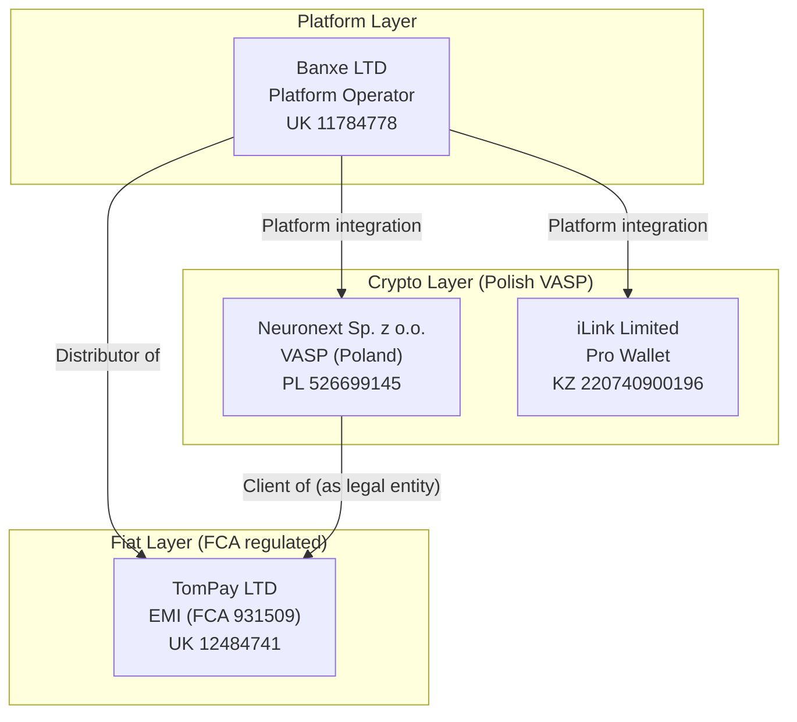
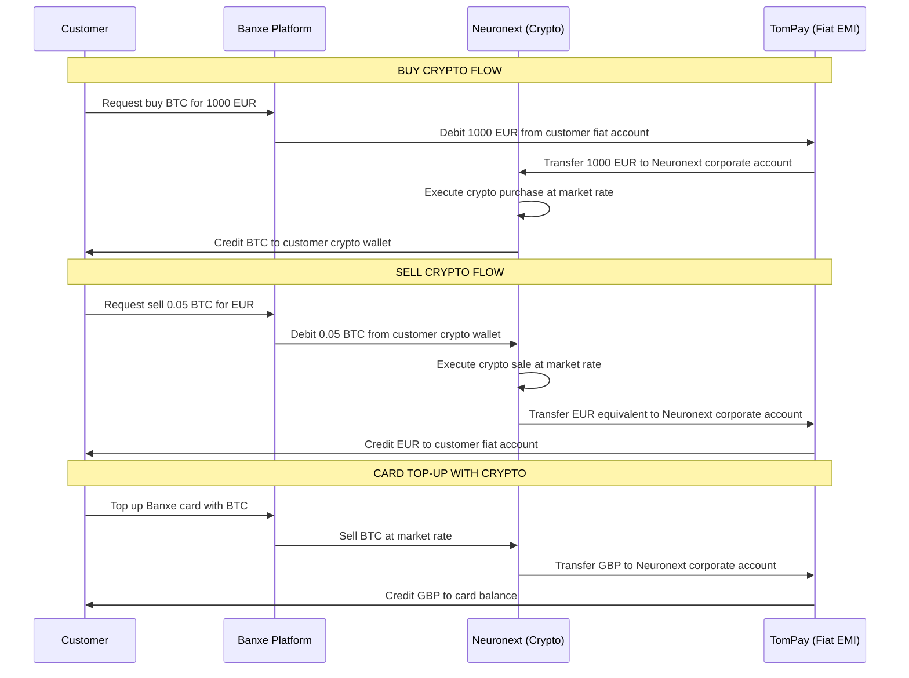
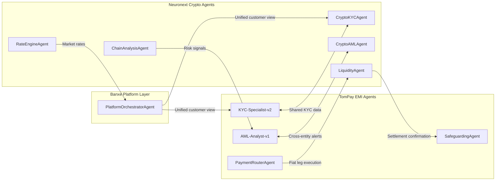

# CRYPTO-BLOCK.md — Banxe Platform Crypto Services Architecture

> IL-070 | Developer Plane | banxe-architecture
> Created: 2026-04-12 | Author: Perplexity Computer + Claude Code
>
> **Purpose**: Describes the crypto services layer of the Banxe platform,
> the legal entity structure (Neuronext / TomPay / Banxe LTD / iLink),
> inter-entity relationships, customer flows, and AI agent mapping.
> This document is CANON for all crypto-related development.

---

## 1. Legal Entity Structure

### 1.1 Platform Entities

| Entity | Jurisdiction | Reg. Number | Role | Licence |
|--------|-------------|-------------|------|--------|
| **Banxe LTD** | England & Wales | 11784778 | Platform operator, website & app, distributor of TomPay | N/A (not regulated directly) |
| **TomPay LTD** | England & Wales | 12484741 | EMI — fiat accounts, payments, cards | FCA 931509 (EMR 2011) |
| **Neuronext Sp. z o.o.** | Poland | 526699145 | Crypto services — buy/sell/exchange/custody | Polish VASP registry |
| **iLink Limited** | Kazakhstan | 220740900196 | Pro Wallet — non-custodial wallet | Kazakhstan digital asset licence |

### 1.2 Entity Relationship Diagram



---

## 2. Customer Onboarding Flows

### 2.1 Unified Platform Onboarding (banxe.com / Banxe App)

Customers (individuals and legal entities) register once on BANXE.COM or the Banxe mobile app. Behind the scenes, the platform provisions accounts with multiple Service Providers.

#### 2.1.1 Individual Customer Flow

```
Customer → banxe.com/sign-up/individual
    │
    ├── KYC (Banxe LTD collects, forwards to Service Providers)
    │   ├── Identity verification (passport/ID)
    │   ├── Address verification
    │   ├── Source of funds declaration
    │   └── PEP/Sanctions screening
    │
    ├── TomPay Account (auto-provisioned)
    │   ├── GBP account (FPS/CHAPS)
    │   ├── EUR account (SEPA, non-dedicated IBAN)
    │   ├── USD account (SWIFT)
    │   └── Debit card (Mastercard, GBP primary)
    │
    ├── Neuronext Crypto Wallet (auto-provisioned)
    │   ├── Custodial crypto wallet
    │   ├── Buy/sell crypto at market rates
    │   ├── Crypto-to-fiat exchange
    │   └── Crypto transfers
    │
    └── iLink Pro Wallet (optional)
        ├── Non-custodial wallet
        ├── 12-digit seed phrase (user controls keys)
        └── Full control over crypto assets
```

#### 2.1.2 Business Customer Flow

```
Business → banxe.com/sign-up/business
    │
    ├── KYB (Know Your Business)
    │   ├── Company registration documents
    │   ├── UBO (Ultimate Beneficial Owner) verification
    │   ├── Director ID verification
    │   └── Source of funds / business activity
    │
    ├── TomPay Business Account
    │   ├── Multi-currency (GBP/EUR/USD)
    │   ├── SWIFT/SEPA/FPS payments
    │   ├── Mass payments
    │   ├── Corporate cards
    │   ├── Team management
    │   └── Xero integration
    │
    ├── Neuronext Corporate Crypto Wallet
    │   ├── Buy/sell crypto
    │   ├── Crypto processing (merchant)
    │   ├── High-volume exchange
    │   └── White-label API (BaaS)
    │
    └── iLink Pro Wallet (optional)
```

---

## 3. Crypto-Fiat Interaction Layer

### 3.1 Neuronext as TomPay Client

**Critical relationship**: Neuronext Sp. z o.o. holds a business account with TomPay LTD as a legal entity client. This enables the crypto-fiat bridge:



### 3.2 Fund Flow Matrix

| Operation | Source Entity | Destination Entity | Currency Flow | Regulatory Layer |
|-----------|--------------|-------------------|---------------|------------------|
| Buy crypto (fiat) | TomPay (customer acc) | Neuronext (corp acc) | EUR/GBP/USD -> Neuronext | FCA (fiat leg) + Polish VASP (crypto leg) |
| Sell crypto (fiat) | Neuronext (crypto wallet) | TomPay (customer acc) | Crypto -> EUR/GBP/USD | Polish VASP (crypto leg) + FCA (fiat leg) |
| Card top-up crypto | Neuronext (crypto wallet) | TomPay (card balance) | Crypto -> GBP | Polish VASP + FCA |
| Crypto-to-crypto | Neuronext (wallet A) | Neuronext (wallet B) | Crypto -> Crypto | Polish VASP only |
| Fiat transfer | TomPay (customer acc) | TomPay (external) | Fiat -> Fiat | FCA only |
| Pro Wallet transfer | iLink (non-custodial) | External blockchain | Crypto -> Crypto | Kazakhstan licence |

### 3.3 Products & Services Mapping

#### TomPay (Fiat) Products:
- Payment account (GBP/EUR/USD)
- Electronic money issuance
- SEPA transfers (36 countries, min EUR 4 fee)
- Faster Payments (UK, free, ~1 min)
- SWIFT international transfers
- Foreign exchange (GBP/EUR/USD)
- Debit card (Mastercard, GBP primary, 10k txn limit)
- Safeguarding accounts (customer fund protection)

#### Neuronext (Crypto) Products:
- Custodial crypto wallets
- Buy/sell crypto at market rates
- Crypto-to-fiat exchange
- Crypto transfers (on-chain)
- High-volume exchange
- Crypto processing (merchant services)
- White-label API (BaaS)

#### iLink (Pro Wallet) Products:
- Non-custodial wallet (12-digit seed phrase)
- Private key control
- Cross-platform wallet import/export
- Master password for transactions

---

## 4. Regulatory & Compliance Framework

### 4.1 Dual-Jurisdiction Compliance

| Aspect | TomPay (UK/FCA) | Neuronext (Poland) |
|--------|----------------|--------------------|
| **Regulator** | FCA (Financial Conduct Authority) | Polish Financial Supervision Authority (KNF) |
| **Licence** | EMI (FCA 931509) | VASP registry (Krajowy Rejestr Sadowy) |
| **AML framework** | MLR 2017, POCA 2002, SAMLA 2018 | Polish AML Act (ustawa o przeciwdzialaniu) |
| **KYC standard** | FCA MLR 2017 Reg.28 | EU AMLD5/AMLD6 |
| **Sanctions** | OFAC + HMT + UN | EU sanctions list + OFAC |
| **Travel Rule** | UK Travel Rule (2023) | EU TFR (Transfer of Funds Regulation) |
| **Consumer protection** | FCA Consumer Duty PS22/9 | Not applicable (crypto not regulated by FCA) |
| **Safeguarding** | CASS 15 (client money segregation) | N/A for crypto |
| **Reporting** | FIN060, RegData, SAR to NCA/UKFIU | Polish FIU (GIIF) reporting |

### 4.2 Crypto-Specific Compliance Requirements

**Travel Rule**: For crypto transfers >EUR 1000, both originator and beneficiary information must be transmitted.

**Crypto risk disclosures** (mandatory on platform):
- Crypto is not regulated by FCA
- No FSCS protection for crypto assets
- Crypto services not provided to UK citizens/residents (Neuronext restriction)
- High volatility risk warning
- No investment advice provided

**Prohibited jurisdictions**: UN/UK/US sanctions lists + FATF high-risk jurisdictions (I-02 invariant applies).

### 4.3 Inter-Entity AML Coordination

```
Customer AML Check Flow:

1. Banxe LTD: Initial KYC collection + forwarding
   |
2. TomPay LTD: Independent AML/KYC check (FCA standard)
   |-- Sanctions screening (HMT/OFAC/UN)
   |-- PEP check
   |-- Risk scoring
   |-- Ongoing transaction monitoring
   |
3. Neuronext Sp. z o.o.: Independent AML/KYC check (EU AMLD6 standard)
   |-- Sanctions screening (EU list + OFAC)
   |-- Travel Rule compliance
   |-- Crypto-specific risk factors (mixing, darknet, high-risk wallets)
   |-- Chain analysis (blockchain forensics)
   |
4. Cross-entity SAR coordination:
   |-- TomPay: Reports to NCA/UKFIU (UK)
   |-- Neuronext: Reports to GIIF (Poland)
   |-- No auto-sharing of SAR between entities (legal restriction)
```

---

## 5. AI Agent Mapping for Crypto Block

### 5.1 Crypto Department AI Agents

| Agent | Task | Entity | Autonomy | Human Double | HITL Gate |
|-------|------|--------|----------|--------------|-----------|
| `CryptoKYCAgent` | Crypto-specific KYC/KYB (AMLD6) | Neuronext | L2 Review | Crypto Compliance Officer | On HIGH risk |
| `ChainAnalysisAgent` | Blockchain forensics, wallet risk scoring | Neuronext | L1 Auto | Crypto AML Analyst | On suspicious patterns |
| `TravelRuleAgent` | TFR compliance for crypto transfers | Neuronext | L1 Auto | Crypto Compliance Officer | On missing data |
| `CryptoAMLAgent` | Crypto transaction monitoring (mixing, layering) | Neuronext | L2 Review | MLRO (Neuronext) | On SAR_REQUIRED |
| `LiquidityAgent` | Crypto-fiat liquidity management | Neuronext | L2 Review | Head of Treasury | On threshold |
| `RateEngineAgent` | Market rate calculation, spread management | Neuronext | L1 Auto | Head of Trading | -- |
| `WalletSecurityAgent` | Hot/cold wallet monitoring, key management | Neuronext | L1 Auto | CISO | On CRITICAL |
| `CryptoSanctionsAgent` | Sanctioned wallet/address screening | Neuronext | L1 Auto (BLOCK) | Crypto Compliance Officer | Reversal -> MLRO |
| `ProWalletAgent` | Non-custodial wallet operations | iLink | L1 Auto | CTO (iLink) | -- |

### 5.2 Cross-Entity Agent Communication



### 5.3 Crypto-Specific HITL Gates

| Decision Type | Required Approver | SLA | Entity |
|--------------|-------------------|-----|--------|
| Crypto SAR filing (Poland) | MLRO (Neuronext) | 4h | Neuronext |
| Sanctioned wallet BLOCK | Auto (MLRO notified) | Immediate | Neuronext |
| Sanctioned wallet reversal | MLRO + CEO | 2h | Neuronext |
| High-risk wallet transfer >EUR 10k | Crypto Compliance Officer | 1h | Neuronext |
| Travel Rule data incomplete | Crypto Compliance Officer | 24h | Neuronext |
| Crypto-to-fiat >EUR 50k | Head of Treasury + CFO | 1h | Both entities |
| New token listing | CEO + CRO | Per governance | Neuronext |
| Hot wallet rebalancing >EUR 100k | Head of Treasury + CISO | 2h | Neuronext |

---

## 6. Implications for Banxe AI Bank (EMI Stack)

### 6.1 Architecture Boundaries

**banxe-emi-stack** currently models the **TomPay EMI layer** only. The crypto block (Neuronext) represents a separate but integrated service domain.

```
+------------------------------------------+
|          BANXE.COM Platform              |
|          (Banxe LTD - operator)          |
+------------------------------------------+
|                    |                     |
|  +---------------+ | +----------------+ |
|  | TomPay EMI    | | | Neuronext      | |
|  | (FCA 931509)  | | | (Polish VASP)  | |
|  |               | | |                | |
|  | banxe-emi-    | | | banxe-crypto-  | |
|  | stack (this   | | | stack (FUTURE) | |
|  | project)      | | |                | |
|  +---------------+ | +----------------+ |
|                    |                     |
|              +----------+                |
|              | iLink    |                |
|              | Pro      |                |
|              | Wallet   |                |
|              +----------+                |
+------------------------------------------+
```

### 6.2 Integration Points (banxe-emi-stack <-> crypto block)

| Integration Point | Direction | Protocol | Implementation |
|------------------|-----------|----------|----------------|
| Customer identity sync | Bidirectional | API/Webhook | `services/identity_bridge/` (FUTURE) |
| Fiat-to-crypto settlement | EMI -> Crypto | Internal API | `services/crypto_settlement/` (FUTURE) |
| Crypto-to-fiat settlement | Crypto -> EMI | Internal API | `services/crypto_settlement/` (FUTURE) |
| Unified AML alerts | Bidirectional | Event bus (RabbitMQ) | `services/cross_entity_aml/` (FUTURE) |
| Rate feed | Crypto -> EMI | WebSocket/REST | `services/rate_feed/` (FUTURE) |
| Safeguarding reconciliation | EMI only | Internal | Already in banxe-emi-stack |

### 6.3 ROADMAP Impact

New phases to be added to ROADMAP.md:

| Phase | Feature | Priority | Depends on |
|-------|---------|----------|------------|
| Phase 14 | Job Descriptions (AI agents + human doubles) | HIGH | ORG-STRUCTURE.md |
| Phase 15 | Feature Registry (all features with value descriptions) | HIGH | ROADMAP.md |
| Phase 16 | Relationship Tree (vertical + horizontal + senior mgmt) | HIGH | Phase 14 |
| Phase 17 | Crypto Block Integration (Neuronext bridge) | MEDIUM | Phase 14, this document |
| Phase 18 | Customer Support Block (Chatwoot + agents) | MEDIUM | Phase 12 ROADMAP |
| Phase 19 | Marketing & Growth Block (Listmonk + agents) | MEDIUM | Phase 13 ROADMAP |

---

## 7. Invariants (Crypto-Specific)

| ID | Invariant | Rule | State |
|----|-----------|------|-------|
| I-30 | No crypto services for UK residents | Neuronext T&C restriction | CANON |
| I-31 | Travel Rule >EUR 1000 | Originator + beneficiary data required | CANON |
| I-32 | Dual AML reporting | TomPay -> NCA/UKFIU; Neuronext -> GIIF | CANON |
| I-33 | No auto-SAR sharing between entities | Legal firewall between TomPay and Neuronext | CANON |
| I-34 | Crypto risk disclosure mandatory | FCA requirement on platform | CANON |
| I-35 | Hot wallet limits | Max EUR 500k in hot wallet; rest in cold storage | CANON |
| I-36 | Neuronext is TomPay client | Corporate account relationship for settlement | CANON |

---

*Document maintained by: Perplexity Computer + Claude Code | IL-070 | 2026-04-12 | I-29 (Documentation Standard)*
