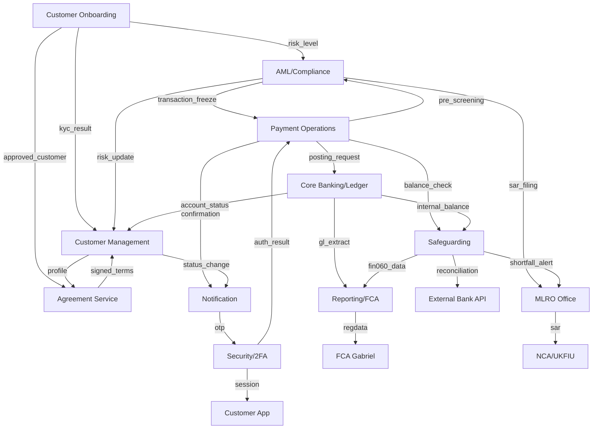

# DEPARTMENT-MAP.md — Banxe EMI Business Architecture
> Source: ArchiMate model Banxe_v5.archimate (Legacy Geniusto → Banxe AI Bank migration)
> Last updated: 2026-04-08 | IL-031 | Claude Code
>
> **Purpose**: Maps the 10 legacy Geniusto business departments to Banxe AI Bank AI agents,
> human doubles, FCA trust zones, and autonomy levels. ~40% of legacy functionality
> was not yet migrated — this document is the authoritative gap register for that delta.

---

## 1. Business Layer — Department Definitions

### 1.1 Customer Onboarding Department

| Element | Details |
|---------|---------|
| **Primary Process** | KYC Process (FCA MLR 2017 §18-27) |
| **IDV Provider** | Sumsub IDV Service — document verification + liveness |
| **KYB Provider** | Companies House API — UBO chain, director registry |
| **Output DTO** | `CustomerProfile { name, DOB, nationality, risk_level }` |
| **Escalation** | → Compliance Department (high / very_high / prohibited risk) |
| **FCA Rule** | MLR 2017 §18 (CDD), §33 (EDD for PEPs), I-04 (≥£10k EDD) |

**Process flows:**
- `KYC Process` → calls → `Sumsub IDV Service` (document + liveness verification)
- `KYC Process` → calls → `Companies House API` (KYB, UBO check)
- `KYC Process` → writes → `Customer Profile` (name, DOB, nationality, risk_level)
- `KYC Process` → escalates → `Compliance Department` (high/very_high risk)

**Department connections:** Compliance (risk assessment), AML (initial screening), Agreement (post-approval)

---

### 1.2 AML/Compliance Department

| Element | Details |
|---------|---------|
| **Primary Actor** | AML Analyst (AI agent + MLRO human double) |
| **Data Source** | Transaction History (ClickHouse banxe.* tables) |
| **Risk Levels** | low / medium / high / very_high / prohibited |
| **SAR Channel** | NCA / UKFIU via FCA Connect (MLRO authority only) |
| **Travel Rule** | FATF compliance check for crypto transactions |
| **FCA Rules** | MLR 2017 §19 (SAR), POCA 2002 s.330, SAMLA 2018 |

**Process flows:**
- `AML Actor` → triggers → `AML Process` (transaction monitoring)
- `AML Process` → reads → `Transaction History` (ClickHouse)
- `AML Process` → applies → `Risk Level Classification` (low/medium/high/very_high/prohibited)
- `AML Process` → escalates → `MLRO` (SAR filing when suspicious activity detected)
- `SAR Workflow` → sends → `NCA` via FCA Connect (MLRO-only authority)
- `Travel Rule Process` → checks → crypto transactions for FATF compliance

**Department connections:** KYC (risk_level input), Payment (transaction freeze), MLRO (escalation)

---

### 1.3 Payment Operations Department

| Element | Details |
|---------|---------|
| **Primary Rails** | TomPayment 1 (FPS, GBP, <15s) / TomPayment 2 (SEPA SCT, EUR) |
| **Router** | Fasterpayment Service — FPS / CHAPS / BACS by amount + urgency |
| **NOSTRO** | Correspondent account reconciliation with external banks |
| **Batch** | Mass Payment Service — payroll / bulk transfers |
| **Auth Gate** | Strong auth required >£30 (PSR 2017 Reg. 71) |
| **FCA Rules** | PSR 2017, FCA PS7/24, PSR APP 2024 |

**Process flows:**
- `TomPayment 1` (Primary) → processes → FPS (GBP instant, <15 sec)
- `TomPayment 2` (Backup) → processes → SEPA SCT (EUR cross-border)
- `Fasterpayment Service` → routes → FPS / CHAPS / BACS by amount + urgency
- `NOSTRO Process` → manages → correspondent accounts (reconciliation with external banks)
- `Mass Payment Service` → processes → batch payroll / bulk transfers

**Department connections:** CBS/Ledger (posting), Safeguarding (balance check pre-execution), AML (pre-screening), Notification (confirmation)

---

### 1.4 Core Banking / Ledger Department

| Element | Details |
|---------|---------|
| **Engine** | Midaz (via MidazAdapter — hexagonal port) |
| **Posting** | ABS Posting Service — double-entry per payment |
| **Accounts** | Current / Savings / E-money wallets |
| **GL** | Debit/credit per payment, FCA CASS 7 segregation |
| **Balance** | Real-time: available / pending / blocked |
| **FCA Rules** | CASS 7.13-7.14 (client_funds/operational accounts) |

**Process flows:**
- `ABS Posting Service` → writes → double-entry transactions in Midaz
- `Account Service` → manages → Customer Accounts (current, savings, e-money wallets)
- `GL Logic` → generates → debit/credit entries per payment
- `Balance Service` → provides → real-time balance (available / pending / blocked)

**Department connections:** Payment (posting trigger), Safeguarding (client_funds segregation), Reporting (GL extract)

---

### 1.5 Safeguarding Department (FCA CASS 7)

| Element | Details |
|---------|---------|
| **Daily Recon** | Safeguarding Engine — internal vs external bank |
| **Breach Monitor** | Breach Detector — discrepancy streak >3 days → FCA alert |
| **Statement** | Statement Fetcher — CAMT.053 from Barclays/HSBC |
| **Return** | FIN060 Generator — monthly PDF + RegData submission |
| **Resolution** | Resolution Pack — CASS 10A 48h retrieval pack |
| **FCA Rules** | CASS 7.15.17R (daily recon), CASS 10A.3.1R (48h pack) |

**Process flows:**
- `Safeguarding Engine` → runs → daily reconciliation (internal vs external bank)
- `Breach Detector` → monitors → discrepancy streak (>3 days → FCA alert)
- `Statement Fetcher` → fetches → CAMT.053 from safeguarding bank (Barclays/HSBC)
- `FIN060 Generator` → creates → monthly FCA return (PDF + RegData submission)
- `Resolution Pack` → prepares → 48h retrieval pack (CASS 10A)

**Department connections:** CBS/Ledger (internal balance), External Bank (statement), MLRO (shortfall alert), FCA (RegData)

---

### 1.6 Customer Management Department

| Element | Details |
|---------|---------|
| **Profile** | Full PII + KYC status + risk level |
| **Dual Entity** | Individual (natural person) vs Company (legal entity) |
| **UBO Registry** | Director/Shareholder chain for corporate customers |
| **Lifecycle** | onboarding → active → dormant → offboarded → deceased |
| **FCA Rules** | UK GDPR Art. 5, FCA COBS 9A, MLR 2017 record-keeping |

**Process flows:**
- `Customer Profile Service` → stores → full profile (PII, KYC status, risk_level)
- `Dual Entity Model` → distinguishes → Individual vs Company
- `Director/Shareholder Registry` → stores → UBO chain for corporate customers
- `Customer Lifecycle` → manages → onboarding → active → dormant → offboarded → deceased

**Department connections:** KYC (verification status), Agreement (contract binding), Notification (status changes)

---

### 1.7 Agreement / Contract Department

| Element | Details |
|---------|---------|
| **Generation** | T&C per product (e-money, FX, savings) |
| **E-signature** | DocuSign / qualified e-sig (eIDAS compatible) |
| **Versioning** | Full history of T&C changes with diff |
| **FCA Rules** | FCA COBS 6 (product disclosure), eIDAS Reg. 910/2014 |

**Process flows:**
- `Agreement Service` → generates → Terms & Conditions per product
- `E-signature Flow` → collects → digital consent (DocuSign/qualified e-sig)
- `Version Control` → stores → history of all T&C changes

**Department connections:** Customer (binding), Product Catalog (per-product terms), Compliance (regulatory review)

---

### 1.8 Notification Department

| Element | Details |
|---------|---------|
| **Channels** | Email (transactional + marketing) + SMS (OTP + alerts) |
| **Push** | Mobile app push notifications |
| **Templates** | Multilingual: EN / RU / FR |
| **2FA** | OTP delivery for strong auth |
| **FCA Rules** | FCA COBS 4 (communications), UK GDPR (consent) |

**Process flows:**
- `Dual Channel` → sends → Email (transactional + marketing) + SMS (OTP + alerts)
- `Push Notification` → sends → mobile app alerts
- `Template Engine` → manages → multilingual templates (EN/RU/FR)

**Department connections:** Payment (confirmation), AML (alert), Customer (status updates), 2FA (OTP delivery)

---

### 1.9 Security / Authentication Department

| Element | Details |
|---------|---------|
| **2FA** | TOTP + SMS OTP (RFC 6238) |
| **Sessions** | JWT tokens + refresh (Keycloak OIDC) |
| **Device** | Device fingerprinting — known devices per customer |
| **RBAC** | Admin Panel — role-based access (FCA SM&CR aligned) |
| **FCA Rules** | FCA SM&CR SYSC 4.7, PSR 2017 Reg. 71 (SCA) |

**Process flows:**
- `2FA Service` → provides → TOTP + SMS OTP
- `Session Management` → manages → JWT tokens + refresh
- `Device Fingerprinting` → tracks → known devices per customer

**Department connections:** Customer App (login), Payment (strong auth >£30), Admin Panel (RBAC)

---

### 1.10 Reporting / FCA Regulatory Department

| Element | Details |
|---------|---------|
| **FIN060** | Monthly safeguarding return (PDF + RegData) |
| **RegData** | Submission via FCA Gabriel/RegData portal |
| **MLRO Report** | Annual SAR statistics + risk assessment |
| **Client Statements** | Monthly PDF/CSV per customer |
| **FCA Rules** | CASS 15.12.4R (monthly return), FCA PS7/24 |

**Process flows:**
- `FIN060 Monthly Return` → generates → safeguarding report (CASS 15)
- `RegData Submission` → sends → to FCA via Gabriel/RegData
- `MLRO Annual Report` → collates → SAR statistics + risk assessment
- `Client Statements` → generates → monthly PDF/CSV for customers

**Department connections:** Safeguarding (data source), AML (SAR stats), CBS (GL extract), CFO (financial reporting)

---

## 2. Department Interconnection Map (Mermaid)

---

## 3. Legacy → AI Agent → Human Double Mapping

| Legacy Department (Geniusto) | AI Agent (Banxe AI Bank) | Human Double | Trust Zone | Autonomy |
|---|---|---|---|---|
| Customer Onboarding | `KYC-Specialist-v2` | Aisha Okonkwo (Compliance Officer) — Appointed 2026-04-13 | 🟡 AMBER | L2 Review |
| AML/Compliance | `AML-Analyst-v1` + `Compliance-Officer-v1` | Sarah Mitchell (MLRO/SMF17) — Appointed 2026-04-13 | 🔴 RED | L3 MLRO |
| Payment Operations | `PaymentRouterAgent` (**NEW** — PROPOSED) | Marcus Webb (Head of Treasury) — Appointed 2026-04-13 | 🔴 RED | L3 MLRO |
| Core Banking/Ledger | `LedgerAgent` (via MidazAdapter) | David Goldstein (CFO/SMF2) — Appointed 2026-04-13 | 🟡 AMBER | L2 Review |
| Safeguarding | `SafeguardingAgent` (recon cron) | Sarah Mitchell (MLRO) + Grant Thornton UK (Ext. Auditor) — Appointed 2026-04-13 | 🔴 RED | L3 MLRO |
| Customer Management | `CustomerLifecycleAgent` (**NEW** — PROPOSED) | Tom Nakamura (Head of Customer Support) — Appointed 2026-04-13 | 🟢 GREEN | L1 Auto |
| Agreement Service | `AgreementAgent` (**NEW** — PROPOSED) | Laura Bennett (Legal Counsel) — Appointed 2026-04-13 | 🟡 AMBER | L2 Review |
| Notification | `NotificationAgent` (n8n workflows) | — | 🟢 GREEN | L1 Auto |
| Security/2FA | `SecurityAgent` (Keycloak + IAM) | Oleg @p314pm (CTIO/SMF26) | 🔴 RED | L4 Board |
| Reporting/FCA | `ReportingAgent` (**NEW** — PROPOSED) | David Goldstein (CFO) + Sarah Mitchell (MLRO) — Appointed 2026-04-13 | 🔴 RED | L3 MLRO |

### Autonomy Levels
| Level | Name | Description |
|-------|------|-------------|
| L1 | Auto | Fully automated, no human review required |
| L2 | Review | Human reviews output before action |
| L3 | MLRO | MLRO or equivalent sign-off required |
| L4 | Board | Board-level decision required |

### Trust Zones
| Zone | Description | FCA Obligation |
|------|-------------|----------------|
| 🟢 GREEN | Low risk — autonomous execution | Standard logging |
| 🟡 AMBER | Medium risk — L2 human review | Audit trail + HITL |
| 🔴 RED | High risk — MLRO/Board gate | Full FCA audit trail + approval chain |

---

## 4. Migration Status (Legacy → Banxe AI Bank)

| Department | Migration % | Blocker | Next Step |
|---|---|---|---|
| Customer Onboarding | 60% | Sumsub API key (BT-004), Companies House key (BT-005) | S5-14 Sumsub integration |
| AML/Compliance | 85% | Live Sardine.ai (BT-009) | S5-22 fraud scoring live |
| Payment Operations | 40% | Modulr/ClearBank API (BT-001) | S5-05 payment rails live |
| Core Banking/Ledger | 75% | Midaz healthcheck (done), GL posting | GL reconciliation |
| Safeguarding | 79% | Barclays/HSBC account (BT-002 area) | S6-09 external bank |
| Customer Management | 10% | S17-01/S17-09 not started | CustomerLifecycleAgent |
| Agreement Service | 5% | S17-02 not started | AgreementAgent PROPOSED |
| Notification | 30% | n8n workflows partial | S17-03 notification service |
| Security/2FA | 40% | Keycloak not deployed, S17-04/S17-08 | KeycloakAdapter live |
| Reporting/FCA | 65% | FCA RegData API key (BT-010) | S6-12 live submission |

**Overall legacy migration: ~49%** (up from ~40% per ArchiMate analysis)

---

## 5. NEW Agents — PROPOSED Passports

The following agents are **PROPOSED** (not yet active). Passports created in `agents/passports/`.

| Agent | Passport File | Status |
|-------|--------------|--------|
| PaymentRouterAgent | `payment_router_agent.yaml` | PROPOSED |
| CustomerLifecycleAgent | `customer_lifecycle_agent.yaml` | PROPOSED |
| AgreementAgent | `agreement_agent.yaml` | PROPOSED |
| ReportingAgent | `reporting_agent.yaml` | PROPOSED |

*NotificationAgent — implemented via n8n workflows (IL-025/IL-026).*
*SecurityAgent — implemented via Keycloak IAM port (IL-029).*

---

*Document maintained by: Claude Code | Source: Banxe_v5.archimate (ArchiMate 3.1) | I-29 (Documentation Standard)*
