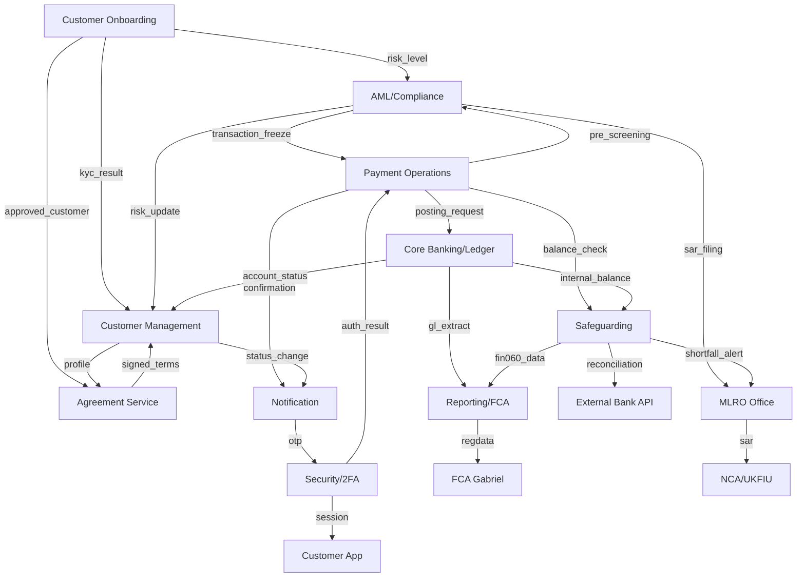

# DEPARTMENT-MAP.md — Banxe EMI Business Architecture
> Source: ArchiMate model Banxe_v5.archimate (Legacy Geniusto → Banxe AI Bank migration)
> Last updated: 2026-04-08 | IL-031 | Claude Code
>
> **Purpose**: Maps the 10 legacy Geniusto business departments to Banxe AI Bank AI agents,
> human doubles, FCA trust zones, and autonomy levels. ~40% of legacy functionality
> was not yet migrated — this document is the authoritative gap register for that delta.

---

## 1. Business Layer — Department Definitions

### 1.1 Customer Onboarding Department

| Element | Details |
|---------|---------|
| **Primary Process** | KYC Process (FCA MLR 2017 §18-27) |
| **IDV Provider** | Sumsub IDV Service — document verification + liveness |
| **KYB Provider** | Companies House API — UBO chain, director registry |
| **Output DTO** | `CustomerProfile { name, DOB, nationality, risk_level }` |
| **Escalation** | → Compliance Department (high / very_high / prohibited risk) |
| **FCA Rule** | MLR 2017 §18 (CDD), §33 (EDD for PEPs), I-04 (≥£10k EDD) |

**Process flows:**
- `KYC Process` → calls → `Sumsub IDV Service` (document + liveness verification)
- `KYC Process` → calls → `Companies House API` (KYB, UBO check)
- `KYC Process` → writes → `Customer Profile` (name, DOB, nationality, risk_level)
- `KYC Process` → escalates → `Compliance Department` (high/very_high risk)

**Department connections:** Compliance (risk assessment), AML (initial screening), Agreement (post-approval)

---

### 1.2 AML/Compliance Department

| Element | Details |
|---------|---------|
| **Primary Actor** | AML Analyst (AI agent + MLRO human double) |
| **Data Source** | Transaction History (ClickHouse banxe.* tables) |
| **Risk Levels** | low / medium / high / very_high / prohibited |
| **SAR Channel** | NCA / UKFIU via FCA Connect (MLRO authority only) |
| **Travel Rule** | FATF compliance check for crypto transactions |
| **FCA Rules** | MLR 2017 §19 (SAR), POCA 2002 s.330, SAMLA 2018 |

**Process flows:**
- `AML Actor` → triggers → `AML Process` (transaction monitoring)
- `AML Process` → reads → `Transaction History` (ClickHouse)
- `AML Process` → applies → `Risk Level Classification` (low/medium/high/very_high/prohibited)
- `AML Process` → escalates → `MLRO` (SAR filing when suspicious activity detected)
- `SAR Workflow` → sends → `NCA` via FCA Connect (MLRO-only authority)
- `Travel Rule Process` → checks → crypto transactions for FATF compliance

**Department connections:** KYC (risk_level input), Payment (transaction freeze), MLRO (escalation)

---

### 1.3 Payment Operations Department

| Element | Details |
|---------|---------|
| **Primary Rails** | TomPayment 1 (FPS, GBP, <15s) / TomPayment 2 (SEPA SCT, EUR) |
| **Router** | Fasterpayment Service — FPS / CHAPS / BACS by amount + urgency |
| **NOSTRO** | Correspondent account reconciliation with external banks |
| **Batch** | Mass Payment Service — payroll / bulk transfers |
| **Auth Gate** | Strong auth required >£30 (PSR 2017 Reg. 71) |
| **FCA Rules** | PSR 2017, FCA PS7/24, PSR APP 2024 |

**Process flows:**
- `TomPayment 1` (Primary) → processes → FPS (GBP instant, <15 sec)
- `TomPayment 2` (Backup) → processes → SEPA SCT (EUR cross-border)
- `Fasterpayment Service` → routes → FPS / CHAPS / BACS by amount + urgency
- `NOSTRO Process` → manages → correspondent accounts (reconciliation with external banks)
- `Mass Payment Service` → processes → batch payroll / bulk transfers

**Department connections:** CBS/Ledger (posting), Safeguarding (balance check pre-execution), AML (pre-screening), Notification (confirmation)

---

### 1.4 Core Banking / Ledger Department

| Element | Details |
|---------|---------|
| **Engine** | Midaz (via MidazAdapter — hexagonal port) |
| **Posting** | ABS Posting Service — double-entry per payment |
| **Accounts** | Current / Savings / E-money wallets |
| **GL** | Debit/credit per payment, FCA CASS 7 segregation |
| **Balance** | Real-time: available / pending / blocked |
| **FCA Rules** | CASS 7.13-7.14 (client_funds/operational accounts) |

**Process flows:**
- `ABS Posting Service` → writes → double-entry transactions in Midaz
- `Account Service` → manages → Customer Accounts (current, savings, e-money wallets)
- `GL Logic` → generates → debit/credit entries per payment
- `Balance Service` → provides → real-time balance (available / pending / blocked)

**Department connections:** Payment (posting trigger), Safeguarding (client_funds segregation), Reporting (GL extract)

---

### 1.5 Safeguarding Department (FCA CASS 7)

| Element | Details |
|---------|---------|
| **Daily Recon** | Safeguarding Engine — internal vs external bank |
| **Breach Monitor** | Breach Detector — discrepancy streak >3 days → FCA alert |
| **Statement** | Statement Fetcher — CAMT.053 from Barclays/HSBC |
| **Return** | FIN060 Generator — monthly PDF + RegData submission |
| **Resolution** | Resolution Pack — CASS 10A 48h retrieval pack |
| **FCA Rules** | CASS 7.15.17R (daily recon), CASS 10A.3.1R (48h pack) |

**Process flows:**
- `Safeguarding Engine` → runs → daily reconciliation (internal vs external bank)
- `Breach Detector` → monitors → discrepancy streak (>3 days → FCA alert)
- `Statement Fetcher` → fetches → CAMT.053 from safeguarding bank (Barclays/HSBC)
- `FIN060 Generator` → creates → monthly FCA return (PDF + RegData submission)
- `Resolution Pack` → prepares → 48h retrieval pack (CASS 10A)

**Department connections:** CBS/Ledger (internal balance), External Bank (statement), MLRO (shortfall alert), FCA (RegData)

---

### 1.6 Customer Management Department

| Element | Details |
|---------|---------|
| **Profile** | Full PII + KYC status + risk level |
| **Dual Entity** | Individual (natural person) vs Company (legal entity) |
| **UBO Registry** | Director/Shareholder chain for corporate customers |
| **Lifecycle** | onboarding → active → dormant → offboarded → deceased |
| **FCA Rules** | UK GDPR Art. 5, FCA COBS 9A, MLR 2017 record-keeping |

**Process flows:**
- `Customer Profile Service` → stores → full profile (PII, KYC status, risk_level)
- `Dual Entity Model` → distinguishes → Individual vs Company
- `Director/Shareholder Registry` → stores → UBO chain for corporate customers
- `Customer Lifecycle` → manages → onboarding → active → dormant → offboarded → deceased

**Department connections:** KYC (verification status), Agreement (contract binding), Notification (status changes)

---

### 1.7 Agreement / Contract Department

| Element | Details |
|---------|---------|
| **Generation** | T&C per product (e-money, FX, savings) |
| **E-signature** | DocuSign / qualified e-sig (eIDAS compatible) |
| **Versioning** | Full history of T&C changes with diff |
| **FCA Rules** | FCA COBS 6 (product disclosure), eIDAS Reg. 910/2014 |

**Process flows:**
- `Agreement Service` → generates → Terms & Conditions per product
- `E-signature Flow` → collects → digital consent (DocuSign/qualified e-sig)
- `Version Control` → stores → history of all T&C changes

**Department connections:** Customer (binding), Product Catalog (per-product terms), Compliance (regulatory review)

---

### 1.8 Notification Department

| Element | Details |
|---------|---------|
| **Channels** | Email (transactional + marketing) + SMS (OTP + alerts) |
| **Push** | Mobile app push notifications |
| **Templates** | Multilingual: EN / RU / FR |
| **2FA** | OTP delivery for strong auth |
| **FCA Rules** | FCA COBS 4 (communications), UK GDPR (consent) |

**Process flows:**
- `Dual Channel` → sends → Email (transactional + marketing) + SMS (OTP + alerts)
- `Push Notification` → sends → mobile app alerts
- `Template Engine` → manages → multilingual templates (EN/RU/FR)

**Department connections:** Payment (confirmation), AML (alert), Customer (status updates), 2FA (OTP delivery)

---

### 1.9 Security / Authentication Department

| Element | Details |
|---------|---------|
| **2FA** | TOTP + SMS OTP (RFC 6238) |
| **Sessions** | JWT tokens + refresh (Keycloak OIDC) |
| **Device** | Device fingerprinting — known devices per customer |
| **RBAC** | Admin Panel — role-based access (FCA SM&CR aligned) |
| **FCA Rules** | FCA SM&CR SYSC 4.7, PSR 2017 Reg. 71 (SCA) |

**Process flows:**
- `2FA Service` → provides → TOTP + SMS OTP
- `Session Management` → manages → JWT tokens + refresh
- `Device Fingerprinting` → tracks → known devices per customer

**Department connections:** Customer App (login), Payment (strong auth >£30), Admin Panel (RBAC)

---

### 1.10 Reporting / FCA Regulatory Department

| Element | Details |
|---------|---------|
| **FIN060** | Monthly safeguarding return (PDF + RegData) |
| **RegData** | Submission via FCA Gabriel/RegData portal |
| **MLRO Report** | Annual SAR statistics + risk assessment |
| **Client Statements** | Monthly PDF/CSV per customer |
| **FCA Rules** | CASS 15.12.4R (monthly return), FCA PS7/24 |

**Process flows:**
- `FIN060 Monthly Return` → generates → safeguarding report (CASS 15)
- `RegData Submission` → sends → to FCA via Gabriel/RegData
- `MLRO Annual Report` → collates → SAR statistics + risk assessment
- `Client Statements` → generates → monthly PDF/CSV for customers

**Department connections:** Safeguarding (data source), AML (SAR stats), CBS (GL extract), CFO (financial reporting)

---

## 2. Department Interconnection Map (Mermaid)


```mermaid
graph TD
    CUST_ONBOARD[Customer Onboarding] -->|risk_level| AML_COMP[AML/Compliance]
    CUST_ONBOARD -->|approved_customer| AGREEMENT[Agreement Service]
    CUST_ONBOARD -->|kyc_result| CUST_MGMT[Customer Management]

    AML_COMP -->|transaction_freeze| PAYMENT[Payment Operations]
    AML_COMP -->|sar_filing| MLRO[MLRO Office]
    AML_COMP -->|risk_update| CUST_MGMT

    PAYMENT -->|posting_request| CBS[Core Banking/Ledger]
    PAYMENT -->|balance_check| SAFEGUARD[Safeguarding]
    PAYMENT -->|pre_screening| AML_COMP
    PAYMENT -->|confirmation| NOTIF[Notification]

    CBS -->|gl_extract| REPORTING[Reporting/FCA]
    CBS -->|internal_balance| SAFEGUARD
    CBS -->|account_status| CUST_MGMT

    SAFEGUARD -->|shortfall_alert| MLRO
    SAFEGUARD -->|fin060_data| REPORTING
    SAFEGUARD -->|reconciliation| EXT_BANK[External Bank API]

    CUST_MGMT -->|profile| AGREEMENT
    CUST_MGMT -->|status_change| NOTIF

    AGREEMENT -->|signed_terms| CUST_MGMT

    NOTIF -->|otp| SECURITY[Security/2FA]
    SECURITY -->|auth_result| PAYMENT
    SECURITY -->|session| CUST_APP[Customer App]

    REPORTING -->|regdata| FCA[FCA Gabriel]
    MLRO -->|sar| NCA[NCA/UKFIU]
```

---

## 3. Legacy → AI Agent → Human Double Mapping

| Legacy Department (Geniusto) | AI Agent (Banxe AI Bank) | Human Double | Trust Zone | Autonomy |
|---|---|---|---|---|
| Customer Onboarding | `KYC-Specialist-v2` | Aisha Okonkwo (Compliance Officer) — Appointed 2026-04-13 | 🟡 AMBER | L2 Review |
| AML/Compliance | `AML-Analyst-v1` + `Compliance-Officer-v1` | Sarah Mitchell (MLRO/SMF17) — Appointed 2026-04-13 | 🔴 RED | L3 MLRO |
| Payment Operations | `PaymentRouterAgent` (**NEW** — PROPOSED) | Marcus Webb (Head of Treasury) — Appointed 2026-04-13 | 🔴 RED | L3 MLRO |
| Core Banking/Ledger | `LedgerAgent` (via MidazAdapter) | David Goldstein (CFO/SMF2) — Appointed 2026-04-13 | 🟡 AMBER | L2 Review |
| Safeguarding | `SafeguardingAgent` (recon cron) | Sarah Mitchell (MLRO) + Grant Thornton UK (Ext. Auditor) — Appointed 2026-04-13 | 🔴 RED | L3 MLRO |
| Customer Management | `CustomerLifecycleAgent` (**NEW** — PROPOSED) | Tom Nakamura (Head of Customer Support) — Appointed 2026-04-13 | 🟢 GREEN | L1 Auto |
| Agreement Service | `AgreementAgent` (**NEW** — PROPOSED) | Laura Bennett (Legal Counsel) — Appointed 2026-04-13 | 🟡 AMBER | L2 Review |
| Notification | `NotificationAgent` (n8n workflows) | — | 🟢 GREEN | L1 Auto |
| Security/2FA | `SecurityAgent` (Keycloak + IAM) | Oleg @p314pm (CTIO/SMF26) | 🔴 RED | L4 Board |
| Reporting/FCA | `ReportingAgent` (**NEW** — PROPOSED) | David Goldstein (CFO) + Sarah Mitchell (MLRO) — Appointed 2026-04-13 | 🔴 RED | L3 MLRO |

### Autonomy Levels
| Level | Name | Description |
|-------|------|-------------|
| L1 | Auto | Fully automated, no human review required |
| L2 | Review | Human reviews output before action |
| L3 | MLRO | MLRO or equivalent sign-off required |
| L4 | Board | Board-level decision required |

### Trust Zones
| Zone | Description | FCA Obligation |
|------|-------------|----------------|
| 🟢 GREEN | Low risk — autonomous execution | Standard logging |
| 🟡 AMBER | Medium risk — L2 human review | Audit trail + HITL |
| 🔴 RED | High risk — MLRO/Board gate | Full FCA audit trail + approval chain |

---

## 4. Migration Status (Legacy → Banxe AI Bank)

| Department | Migration % | Blocker | Next Step |
|---|---|---|---|
| Customer Onboarding | 60% | Sumsub API key (BT-004), Companies House key (BT-005) | S5-14 Sumsub integration |
| AML/Compliance | 85% | Live Sardine.ai (BT-009) | S5-22 fraud scoring live |
| Payment Operations | 40% | Modulr/ClearBank API (BT-001) | S5-05 payment rails live |
| Core Banking/Ledger | 75% | Midaz healthcheck (done), GL posting | GL reconciliation |
| Safeguarding | 79% | Barclays/HSBC account (BT-002 area) | S6-09 external bank |
| Customer Management | 10% | S17-01/S17-09 not started | CustomerLifecycleAgent |
| Agreement Service | 5% | S17-02 not started | AgreementAgent PROPOSED |
| Notification | 30% | n8n workflows partial | S17-03 notification service |
| Security/2FA | 40% | Keycloak not deployed, S17-04/S17-08 | KeycloakAdapter live |
| Reporting/FCA | 65% | FCA RegData API key (BT-010) | S6-12 live submission |

**Overall legacy migration: ~49%** (up from ~40% per ArchiMate analysis)

---

## 5. NEW Agents — PROPOSED Passports

The following agents are **PROPOSED** (not yet active). Passports created in `agents/passports/`.

| Agent | Passport File | Status |
|-------|--------------|--------|
| PaymentRouterAgent | `payment_router_agent.yaml` | PROPOSED |
| CustomerLifecycleAgent | `customer_lifecycle_agent.yaml` | PROPOSED |
| AgreementAgent | `agreement_agent.yaml` | PROPOSED |
| ReportingAgent | `reporting_agent.yaml` | PROPOSED |

*NotificationAgent — implemented via n8n workflows (IL-025/IL-026).*
*SecurityAgent — implemented via Keycloak IAM port (IL-029).*

---

*Document maintained by: Claude Code | Source: Banxe_v5.archimate (ArchiMate 3.1) | I-29 (Documentation Standard)*

---

## Canonical ORG-CHART v1 — 5-Level AI Hierarchy

> SP-ORGCANON (2026-06-21, append-only). Reconciles the 10 ArchiMate departments (§1–§5 above,
> IL-031) INTO the canonical 8-department SM&CR frame. Existing content is preserved — this section
> only adds the SM&CR roll-up + 5-level AI hierarchy. HITL gate IDs reference the existing
> `HITL-MATRIX.yaml` (unchanged). Agents named below are existing (34 on main) or PROPOSED (13 in
> PR #638) — none invented here.

### A. Five-Level AI Hierarchy

```
L0  Board & Committees                 — HUMAN principals (Board, RemCo, AuditCo, RiskCo)
 │
L1  CEO Orchestration Agent            — top orchestrator
 ├─ Independent MLRO Agent             — non-delegable financial-crime authority (SMF17)
 └─ Internal Audit Agent               — 3rd Line, read-only assurance (SMF5)
 │
L2  Department-Head Agents             — one per department  ←  human_double lives HERE ONLY
 │
L3  Controller / Team-Lead Agents      — sub-function leads (NO human_double)
 │
L4  Specialist Worker Agents           — task executors (NO human_double)
```

**RULE (explicit):** `human_double` is assigned **ONLY to L2 Department-Head Agents** and the L1
independent MLRO / Internal-Audit agents. **L3 Controllers and L4 Specialist Workers carry NO
`human_double`** — they escalate to their L2 head, who holds the SM&CR-accountable human.

### B. 8 Departments — SM&CR roll-up of the 10 ArchiMate departments

| # | Department | SM&CR owner | L2 Dept-Head Agent | human_double | HITL gate (ref) | LoD | reports_to | Rolled-up ArchiMate dept(s) |
|---|-----------|-------------|--------------------|--------------|-----------------|-----|------------|------------------------------|
| 1 | Board / Executive | CEO (SMF1) | **TODO** `ceo_orchestration_agent` (PROPOSED candidate) | CEO | HITL-008 (SAR retraction co-sign) | governing | Board | — |
| 2 | Independent Functions (Risk/Compliance/Audit) | CRO (SMF4) · Head of Compliance · Internal Audit (SMF5) | Compliance → `banxe_aml_orchestrator`; Audit → `safeguarding_audit_agent` (partial) + **TODO** `internal_audit_agent`; Risk → **TODO** `risk_oversight_agent` | CRO / Compliance / Audit | HITL-012 (AML threshold), HITL-014 (model update) | 2nd & 3rd | CEO Orchestration Agent / Board | AML/Compliance (audit slice), Safeguarding (audit slice) |
| 3 | CFO Office | CFO (SMF2) | **TODO** `cfo_orchestration_agent` | CFO | HITL-010 (FCA RegData) | 1st/2nd | CEO Orchestration Agent | Core Banking/Ledger, Reporting/FCA |
| 4 | COO Operations | COO (SMF24) | **TODO** `coo_operations_agent` | COO | HITL-009 (tx HOLD), HITL-011 (safeguarding shortfall) | 1st | CEO Orchestration Agent | Payment Operations, Safeguarding, Customer Management |
| 5 | CTO Technology/Data/AI | CTO (SMF26) | **TODO** `cto_platform_agent` | CTO | HITL-013 (prod deploy), HITL-015 (security incident) | 1st | CEO Orchestration Agent | Security/2FA, Notification, Core Banking (ledger tech) |
| 6 | MLRO Financial Crime | MLRO (SMF17) | **`banxe_aml_orchestrator`** (L1, existing) | **MLRO** | HITL-001 (SAR, non-deleg.), HITL-004 (sanctions reversal), HITL-007 (PEP) | 2nd | CEO Orchestration Agent + Board (independent line) | AML/Compliance, Customer Onboarding (KYC) |
| 7 | Front Office / Business | CCO | **TODO** `front_office_agent` | CCO | HITL-017 (new product), HITL-016 (large tx) | 1st | CEO Orchestration Agent | — (new vs ArchiMate) |
| 8 | HR / Legal / Corporate + DPO | HR/Legal lead + DPO | HR → `hr_agent` (PROPOSED); DPO → `privacy_compliance_agent`; Legal → **TODO** `legal_corporate_agent` | HR/Legal · DPO | HITL-006 (KYC reject — DSAR adjacent) | 2nd | CEO Orchestration Agent | Agreement Service (Legal slice) |

### C. L3/L4 sub-function agents (no human_double — escalate to their L2 head)

| Dept-head (L2) | L3/L4 agents (existing / PROPOSED) |
|----------------|-----------------------------------|
| MLRO (Dept 6) | `tx_monitor`, `aml_orchestrator`, `jube_adapter`, `sanctions_check`, `watchman_adapter`, `yente_adapter`, `crypto_aml`, `case_management_agent`*; **TODO** `kyc_specialist_agent`, `fraud_detection_agent` |
| CFO (Dept 3) | `treasury_alm_agent`, `reporting_agent`, `regulatory_returns_governor`, `bi_dashboard_governor`, `wind_down_planning_agent` |
| COO (Dept 4) | `payment_router_agent`, `channel_c_sepa_orchestrator`, `channel_c_swift_orchestrator`, `safeguarding_recon_governor`, `customer_lifecycle_agent`, `support_sla_governor`, `crm_dsar_governor` |
| CTO (Dept 5) | `m_gateway_api_governor`, `midaz_mcp_agent`*, `webhook_orchestrator_agent`*, `webhooks_agent`*, `data_lake_elt_agent`, `ml_pipeline_agent`*, `sandbox_rails_governor`, `sdk_release_governor`, `design_pipeline_agent`*, `reasoning_bank_agent`*, `experiment_copilot_agent`*, `resilience_agent` |
| HR/Legal (Dept 8) | `hr_agent`*, `privacy_compliance_agent`, `crm_dsar_governor`, `user_preferences_agent`*, `document_management_agent`* |
| Front Office (Dept 7) | `pricing_fee_governor`, `m_gateway_api_governor` (BaaS) |
| Independent (Dept 2) | `adverse_media_governor`, `fatca_crs_reporting_governor`, `alerting_agent`* |

`*` = PROPOSED (PR #638). Agents in **TODO** rows have **no passport yet** — PROPOSED candidates, **NOT created in this block**.

### D. Dept-heads with NO agent yet → TODO PROPOSED candidates (not created here)

`ceo_orchestration_agent` · `risk_oversight_agent` · `internal_audit_agent` · `cfo_orchestration_agent` · `coo_operations_agent` · `cto_platform_agent` · `front_office_agent` · `legal_corporate_agent` · `kyc_specialist_agent` · `fraud_detection_agent`

### E. HITL cross-reference (HITL-MATRIX.yaml — unchanged)

All critical gates referenced above already exist in `HITL-MATRIX.yaml` (IL-065) — **no gate added or
modified** by SP-ORGCANON (HITL-delta = 0; production consumer `services/hitl/org_roles.py` unaffected):
HITL-001 SAR Filing · HITL-004 Sanctions Reversal · HITL-007 PEP Onboarding · HITL-008 SAR Retraction ·
HITL-009 Transaction HOLD · HITL-010 FCA RegData · HITL-012 AML Threshold Change · HITL-013 Production
Deploy · HITL-014 AI Model Update · HITL-015 Security Incident CRITICAL.

---

*SP-ORGCANON append — Canonical ORG-CHART v1 5-level hierarchy reconciled onto the ArchiMate IL-031 map. Governance-only, append-only (del=0).*

### F. Maturity status (✅ ready / 🔧 partial / ❌ not started)

> Synthesis of the BANXE AI BANK maturity analysis (25 ✅ · 10 🔧 · 11 ❌). Sections A–E unchanged.

| # | Department (SM&CR) | Maturity | Note |
|---|--------------------|----------|------|
| 1 | Board / Executive (CEO SMF1) | 🔧 | Orchestration agent TODO; governance gates live (HITL) |
| 2 | Independent (CRO/Compliance/Audit) | ✅ | AML/compliance/audit agents live; risk-oversight agent TODO |
| 3 | CFO Office (SMF2) | 🔧 | Ledger/BI/treasury-ALM ✅; **Reg-Reporting FIN060 ❌ (P0: CEO-verify/FIN060)** |
| 4 | COO Operations (SMF24) | ❌ **CRITICAL** | **Payments/Treasury = 0 ready blocks — 4× P0** (see below); safeguarding/customer 🔧 |
| 5 | CTO Technology/Data/AI (SMF26) | ✅ | Integrations/AI-platform/op-resilience live; control plane mapped (§H) |
| 6 | MLRO Financial Crime (SMF17) | ✅ | AML TM / sanctions / case-mgmt live; KYC/fraud specialist agents TODO |
| 7 | Front Office / Business (CCO) | ❌ | No dept-head agent; retail/corporate/BaaS not started |
| 8 | HR / Legal / DPO | 🔧 | DPO/consent live; HR PROPOSED; legal agent TODO |

**🔴 CRITICAL GAP — Payments / Treasury (Dept 4) = 0 ready blocks, 4× P0:**
1. **Payment API** (Modulr/ClearBank rails — BT-001)
2. **ClickHouse payments** (payment-event audit store)
3. **Reconciliation cron** (daily safeguarding/payment recon automation)
4. **CEO-verify / FIN060** (regulatory return sign-off path)

These 4× P0 are the single largest org-maturity blocker; they cross-link to the SP-THIN residuals and the
existing BT-markers (sandbox-deferred to production cutover; operator/CEO scope).

### G. L4 AML specialist workers (newly mapped)

PROPOSED-candidate **L4 Specialist Workers** under **MLRO (Dept 6)** — escalate to
`banxe_aml_orchestrator`, **NO `human_double`** (per §A RULE). Exist in emi-stack `services/swarm/`
per the maturity analysis; **passports NOT created here** (PROPOSED candidates only).

| L4 Worker (candidate) | Function | Escalates to | human_double |
|-----------------------|----------|--------------|--------------|
| `behavior_agent` | behavioural anomaly detection | `banxe_aml_orchestrator` (L1/MLRO) | none (L4) |
| `geo_risk_agent` | geographic / jurisdiction risk | `banxe_aml_orchestrator` (L1/MLRO) | none (L4) |
| `profile_history_agent` | customer profile-history risk | `banxe_aml_orchestrator` (L1/MLRO) | none (L4) |

### H. AI-Operations / Orchestration layer (L3 control plane)

The **agent-control plane** under **CTO (Dept 5)** — agents that manage OTHER agents (L3 control,
not domain workers). Referenced via existing `reasoning_bank_agent` passport; the rest are
org-placed here (infrastructure, not new domain agents):

| Component | Role | Evidence |
|-----------|------|----------|
| **Agent Routing Layer (ARL)** | gateway + Tier-1/2/3 routing | emi-stack ARL (184 tests) |
| **Swarm Orchestrator** | star / hierarchy / ring topologies | `agents/swarms/*.yaml` |
| **ReasoningBank** | vector + PostgreSQL case memory | `reasoning_bank_agent` (PROPOSED, PR #638) |
| **MCP Server** | infra steward, 15 MCP tools, 6h health | AGENT-ORG-STRUCTURE §"MCP Server Agent" |

**Org-structure gaps to surface → TODO PROPOSED departments/agents (NOT created here):**
Treasury / Liquidity (`liquidity_risk_agent`) · Account Management (`account_management_agent`) ·
Customer Support / Chatbot (`customer_support_agent`) · Credit Risk (`credit_risk_agent`) ·
DPIA / Privacy-Impact (`dpia_agent`).

---

*SP-ORGCANON extension — maturity (§F) + L4 AML workers (§G) + AI-Ops control plane (§H). Governance-only, append-only (del=0). Roadmap follow-ups in ROADMAP.md.*

### I. Canonical cross-reference & deltas

> `docs/ORG-STRUCTURE.md` (IL-065/066/067) is the **AUTHORITATIVE** source for per-agent detail —
> autonomy (L1/L2/L3), decision thresholds, SLA, legal basis, Trust-Zone, EU AI Act Art.9/14/17/22.
> DEPARTMENT-MAP §A–§H is the **navigational roll-up**. **On any conflict, `ORG-STRUCTURE.md` wins.**
> This section LINKS to it and records only genuine deltas — it does NOT duplicate it.

#### I.1 Authority pointer — 8 SM&CR departments → ORG-STRUCTURE.md sections

| Dept | ORG-STRUCTURE.md section |
|------|--------------------------|
| 1 Board / Executive | §1, §2.1 |
| 2 Independent (Risk/Compliance/Audit) | §2.2 (CRO), §2.4 (Internal Audit) |
| 3 CFO Office | §2.5 + **§7** (Five-Level CFO block, 22 agents + OSS) |
| 4 COO Operations | §2.6 (§2.6.1 Payments, §2.6.2 Safeguarding, §2.6.3 Customer Ops) |
| 5 CTO Technology/Data/AI | §2.7 (§2.7.1 Data&ML, §2.7.2 DevOps, §2.7.3 Integrations, §2.7.4 Security/IAM) |
| 6 MLRO Financial Crime | §2.3 |
| 7 Front Office / Business | §2.8 (§2.8.1 Customer Support, §2.8.2 Marketing) |
| 8 HR / Legal / DPO | §2.9 |

#### I.2 STRUCTURAL CORRECTION — MLRO independence (genuine delta)

Per `ORG-STRUCTURE.md` §7.1 box (*"MLRO FUNCTION (independent from CFO — reports to Board)… NOT part
of CFO finance block"*) and §3 (2nd Line of Defence): **Dept 6 (MLRO Financial Crime) is INDEPENDENT —
it reports to the BOARD directly**, on the **same independent line as Internal Audit (Dept 2)**, NOT
through the CFO/CEO management chain. *(Annotation only — §B Dept-6 `reports_to` row is preserved
append-only; read `reports_to = Board (independent line)` as the authoritative value.)*

#### I.3 Missing-from-map deltas — reference rows (see ORG-STRUCTURE, not re-specified here)

| Delta | Canonical value | Source |
|-------|-----------------|--------|
| Numeric thresholds | ledger adj >£10k (CFO); treasury >£100k (CFO); payment >£50k (COO/CFO); strong-auth >£30 (PSR 2017, auto); security CRITICAL → CEO ≤2h (SYSC 8.1) | ORG §2.5/§2.6/§6 |
| Gate SLA + legal basis | SAR 4h (POCA 2002 s.330); EDD 24h (MLR 2017 Reg.28); CASS 7 safeguarding; CASS 10A resolution pack | ORG §6 + HITL-MATRIX |
| Customer Support dept | `CustomerSupportAgent` spec (fills §H "Customer Support" gap with an EXISTING spec) | ORG §2.8.1 |
| Marketing dept | `CampaignAgent`; **COBS 4 — all financial promos reviewed by MLRO before publication; AI drafts, NEVER auto-publishes** | ORG §2.8.2 |
| CFO 5-level finance block | Controlling / FP&A / Treasury-ALM / Reg-Reporting / Finance-BI — 22 agents + OSS stack (canonical Dept 3 decomposition) | ORG §7 / §7.1 / §7.3 |
| Vendor integrations (runtime deps under CTO Dept 5) | Modulr `ModulrAdapter` (pending BT-001); Sumsub `SumsubAdapter` (pending BT-004); Ballerine/Jube/Marble deployed | ORG §2.7.3 |

#### I.4 Agent name-alignment — TODO placeholders → ORG-STRUCTURE canonical names

> Adopt these canonical names **before** creating any passport (avoids duplicate agents). No agents created here.

| §B/§C/§D TODO placeholder | ORG-STRUCTURE canonical name |
|---------------------------|------------------------------|
| `kyc_specialist_agent` | `KYC-Specialist-v2` |
| `fraud_detection_agent` | `FraudScoringAgent` |
| `risk_oversight_agent` | `RiskOversightAgent` |
| CFO ledger sub-agent | `LedgerAgent` / `ReconciliationAgent` |
| reg-data sub-agent | `RegDataAgent` |
| deploy sub-agent | `DeployAgent` |
| security sub-agent | `SecurityAgent` / `IAMAgent` |
| `customer_support_agent` (§H gap) | `CustomerSupportAgent` (ORG §2.8.1) |

---

*SP-ORGCANON §I — canonical cross-reference to ORG-STRUCTURE.md (authoritative), MLRO-independence correction, missing-delta reference rows, agent name-alignment. Governance-only, append-only (del=0). No duplication of the source of truth.*
