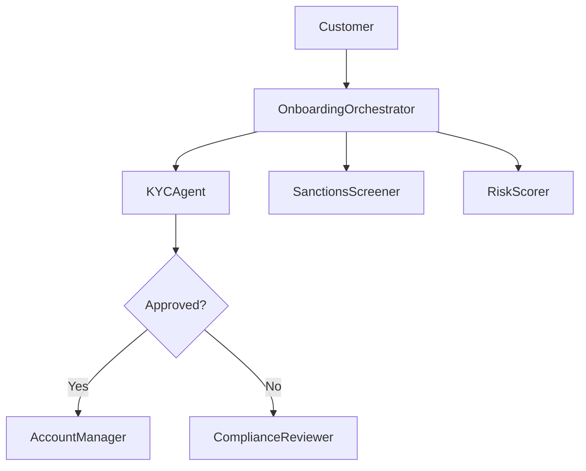

# DEV-DOCUMENTATION-GUIDE.md
## Banxe AI Bank — Developer Auto-Documentation Pipeline
### How documentation is generated, maintained, and published automatically

---

## 1. Overview

Banxe AI Bank uses a **multi-layer documentation system** that generates and maintains professional developer documentation automatically across two repositories:

| Repository | Purpose | Auto-generation |
|-----------|---------|----------------|
| `banxe-architecture` | Architecture decisions, invariants, org structure | MkDocs + GitHub Pages |
| `banxe-emi-stack` | Code-level docs, API specs, runbooks | Claude Code hooks + LucidShark |

### Documentation Layers

```
Layer 1: Code-Level (auto-generated)
  └── Docstrings → Sphinx/pdoc → HTML API docs
  └── FastAPI → OpenAPI/Swagger → /docs endpoint
  └── Type hints → mypy reports
  └── Test coverage → pytest-cov reports

Layer 2: Architecture-Level (semi-auto)
  └── MkDocs Material → GitHub Pages site
  └── Mermaid diagrams → rendered in docs
  └── ADR records → decision log
  └── CHANGELOG → conventional commits

Layer 3: Operational (auto-maintained)
  └── Claude Code hooks → post-edit scan + docs update
  └── LucidShark → code quality reports
  └── Semgrep → security scan reports
  └── n8n workflows → notification docs

Layer 4: Compliance (regulated)
  └── FCA regulatory docs → compliance/ folder
  └── Audit trail → git history + INSTRUCTION-LEDGER
  └── SAR/STR templates → versioned
```

---

## 2. Auto-Documentation Tools

### 2.1 MkDocs Material (Architecture Docs)

**Config:** `banxe-architecture/mkdocs.yml`

**Features:**
- Material Design theme with dark/light mode
- Full-text search
- Mermaid diagram rendering
- Git revision dates on every page
- Versioning via `mike`
- Auto-deploy to GitHub Pages via CI

**Local development:**
```bash
# Install
pip install mkdocs-material mkdocs-minify-plugin mkdocs-git-revision-date-localized-plugin

# Serve locally
mkdocs serve -a 0.0.0.0:8000

# Build
mkdocs build

# Deploy to GitHub Pages
mkdocs gh-deploy --force
```

### 2.2 FastAPI Auto-Docs (API Documentation)

**Endpoint:** `http://localhost:8000/docs` (Swagger UI)
**Endpoint:** `http://localhost:8000/redoc` (ReDoc)

FastAPI automatically generates OpenAPI 3.0 documentation from:
- Route decorators (`@app.get`, `@app.post`)
- Pydantic models (request/response schemas)
- Docstrings (endpoint descriptions)
- Type hints (parameter types)

**Best practices:**
```python
from pydantic import BaseModel, Field

class CustomerOnboardingRequest(BaseModel):
    """Request schema for customer onboarding."""
    first_name: str = Field(..., description="Customer first name", example="John")
    last_name: str = Field(..., description="Customer last name", example="Doe")
    email: str = Field(..., description="Customer email address")
    risk_level: str = Field(default="pending", description="Initial risk level")

@app.post("/api/v1/customers/onboard",
          response_model=CustomerOnboardingResponse,
          tags=["Onboarding"],
          summary="Start customer onboarding",
          description="Initiates KYC/KYB verification flow")
async def onboard_customer(request: CustomerOnboardingRequest):
    """Start the customer onboarding process.

    This endpoint triggers the full onboarding pipeline:
    1. Identity verification (Sumsub IDV)
    2. Sanctions screening
    3. Risk assessment
    4. Account creation (if approved)
    """
    ...
```

### 2.3 Sphinx / pdoc (Python API Docs)

**Config:** `banxe-emi-stack/docs/conf.py` (to be created)

```bash
# Generate HTML docs from docstrings
pdoc --html --output-dir docs/api banxe_mcp agents api

# Or with Sphinx
sphinx-apidoc -o docs/api banxe_mcp agents api
sphinx-build -b html docs/api docs/_build
```

**Docstring standard (Google style):**
```python
def process_payment(amount: Decimal, currency: str, beneficiary_id: str) -> PaymentResult:
    """Process an outbound payment.

    Args:
        amount: Payment amount in minor units.
        currency: ISO 4217 currency code (EUR, USD, GBP).
        beneficiary_id: Unique identifier of the beneficiary.

    Returns:
        PaymentResult with transaction ID and status.

    Raises:
        SanctionsHitError: If beneficiary fails sanctions screening.
        InsufficientFundsError: If account balance is insufficient.
        ComplianceBlockError: If transaction monitoring flags the payment.
    """
    ...
```

### 2.4 Conventional Commits + Auto-Changelog

**Standard:** [Conventional Commits v1.0.0](https://www.conventionalcommits.org/)

**Commit format:**
```
<type>(<scope>): <description>

[optional body]

[optional footer(s)]
```

**Types:**
| Type | Description | Example |
|------|-------------|--------|
| `feat` | New feature | `feat(onboarding): add Sumsub IDV integration` |
| `fix` | Bug fix | `fix(payments): correct SEPA timeout handling` |
| `docs` | Documentation | `docs: add CRYPTO-BLOCK.md (IL-070)` |
| `refactor` | Code restructuring | `refactor(agents): extract base agent class` |
| `test` | Tests | `test(kyc): add sanctions screening tests` |
| `ci` | CI/CD | `ci: add MkDocs deploy workflow` |
| `infra` | Infrastructure | `infra: add mkdocs.yml (IL-084)` |
| `chore` | Maintenance | `chore: update dependencies` |
| `perf` | Performance | `perf(ledger): optimize balance queries` |
| `security` | Security | `security: patch XSS in customer portal` |
| `compliance` | Regulatory | `compliance: update SAR template for 2026` |

**Auto-changelog generation:**
```bash
# Install
pip install commitizen

# Generate changelog
cz changelog

# Bump version + changelog
cz bump --changelog
```

**Config (`pyproject.toml`):**
```toml
[tool.commitizen]
name = "cz_conventional_commits"
version = "0.1.0"
tag_format = "v$version"
changelog_file = "CHANGELOG.md"
update_changelog_on_bump = true
```

### 2.5 Claude Code Auto-Documentation Hooks

Claude Code (via `.claude/hooks/`) automatically maintains documentation:

**Post-edit hook** (`post-edit-scan`):
1. Runs LucidShark scan on changed files
2. Updates `docs/API.md` if API routes changed
3. Updates `docs/ARCHITECTURE-*.md` if architectural patterns changed
4. Regenerates agent soul files if agent behavior changed

**Pre-commit hook** (`pre-commit-quality`):
1. Full LucidShark scan (`domains=["all"]`)
2. Semgrep security scan
3. Type checking (mypy)
4. Test execution
5. Documentation freshness check

**Session continuity protocol:**
- Every session starts with context restoration
- INSTRUCTION-LEDGER tracks all changes
- Infrastructure Checklist ensures docs updated per feature

---

## 3. CI/CD Pipeline for Documentation

### 3.1 GitHub Actions Workflow

**File:** `.github/workflows/docs.yml`

Triggers:
- Push to `main` branch (any `.md` file or `mkdocs.yml`)
- Manual dispatch

Steps:
1. Checkout repository
2. Install Python + MkDocs dependencies
3. Build MkDocs site
4. Deploy to GitHub Pages (`gh-pages` branch)

### 3.2 API Docs CI

**File:** `.github/workflows/api-docs.yml` (in banxe-emi-stack)

Triggers:
- Push to `refactor/claude-ai-scaffold` branch (any `.py` file)

Steps:
1. Checkout + install dependencies
2. Run `pdoc --html` to generate API docs
3. Export OpenAPI schema from FastAPI
4. Upload artifacts / deploy to docs site

---

## 4. Documentation Standards

### 4.1 File Naming Convention
```
UPPERCASE-KEBAB.md     → Architecture docs (ORG-STRUCTURE.md)
lowercase-kebab.md     → Technical docs (payment-rails-spec.md)
ARCHITECTURE-NN-*.md   → Numbered architecture docs
IL-NNN                 → Instruction Ledger reference
```

### 4.2 Document Template
Every architecture document MUST include:
```markdown
# DOCUMENT-NAME.md
## Banxe AI Bank — [Title]
### [Subtitle]

---

## Table of Contents
...

---

[Content sections]

---

> Document Version: X.Y | Created: Phase N | I-29 (Documentation Standards)
> Last Updated: YYYY-MM-DD | Status: ACTIVE/DRAFT/DEPRECATED
> Cross-references: [related docs]
```

### 4.3 Mermaid Diagrams
Use Mermaid for all diagrams in documentation:
```markdown

```

### 4.4 Versioning
- Architecture docs: Semantic versioning via `mike` (MkDocs)
- API docs: Auto-versioned via OpenAPI schema version
- CHANGELOG: Auto-generated from conventional commits
- ADR records: Immutable once accepted (new ADR to supersede)

---

## 5. Documentation Map

### Where to find what:

| Need | Location | Auto-generated? |
|------|----------|----------------|
| API endpoints | `/docs` (Swagger) | Yes (FastAPI) |
| Python API reference | `docs/api/` | Yes (pdoc/Sphinx) |
| Architecture decisions | `banxe-architecture/docs/` | Semi (MkDocs) |
| Code quality reports | LucidShark output | Yes |
| Security scan results | Semgrep output | Yes |
| Test coverage | pytest-cov HTML | Yes |
| Deployment procedures | `docs/runbooks/` | Manual |
| Compliance documents | `docs/compliance/` | Manual |
| Change history | `CHANGELOG.md` | Yes (commitizen) |
| Decision records | `decisions/` (ADR) | Manual |
| Agent specifications | `.claude/agents/` | Semi (Claude) |
| Feature descriptions | `docs/FEATURE-REGISTRY.md` | Manual |
| Job descriptions | `docs/JOB-DESCRIPTIONS.md` | Manual |
| Org relationships | `docs/RELATIONSHIP-TREE.md` | Manual |

---

## 6. Quick Start

```bash
# 1. Clone both repos
git clone git@github.com:CarmiBanxe/banxe-architecture.git
git clone git@github.com:CarmiBanxe/banxe-emi-stack.git

# 2. Install documentation tools
pip install mkdocs-material mkdocs-minify-plugin \
  mkdocs-git-revision-date-localized-plugin \
  pdoc commitizen mike

# 3. Serve architecture docs locally
cd banxe-architecture
mkdocs serve

# 4. View API docs
cd ../banxe-emi-stack
docker-compose up api
# Open http://localhost:8000/docs

# 5. Generate changelog
cz changelog
```

---

> Document Version: 1.0 | Created: Phase 3 | I-29 (Documentation Standards)
> Last Updated: 2025-01-20 | Status: ACTIVE
> Cross-references: mkdocs.yml, CHANGELOG-POLICY.md, .github/workflows/docs.yml
