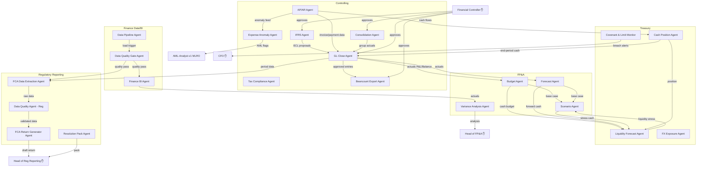

# FINANCE-BLOCK-ROLES.md — Banxe AI Bank: Finance Block AI Agent Job Descriptions
> IL-066 (created) | IL-067 (OSS stack corrected) | Developer Plane | banxe-architecture
> Created: 2026-04-09 | Author: Claude Code
>
> **Scope**: CFO block — 5 sub-blocks, 22 AI agents, 4–5 human doubles.
> **Source**: "Banxe AI Bank: Классический Финансово-Аналитический Блок EMI — Исправленная Архитектура"
>           + ORG-STRUCTURE.md section 2.5 + HITL-MATRIX.yaml
> **Full OSS stack reference**: `docs/FINANCE-BLOCK-OSS-STACK.md` (IL-067)
>
> **Key principle**: AI agent = "always-on analyst/executor" that monitors data and prepares
> decisions. Human double = block head who sets tasks, approves assumptions,
> signs all legally significant actions (IFRS, taxes, regulatory returns).
>
> **AML/KYC/Fraud is NOT part of this block.** It is under MLRO function, reporting
> directly to Board — independent from CFO. See ORG-STRUCTURE.md section 2.3.

---

## 0. Corrected CBS Architecture (shared by all Finance AI agents)

> OSS stack corrected per IL-067. Previous errors: Camunda 7 CE (EOL) → FINOS Fluxnova;
> JasperReports Server CE (withdrawn) → WeasyPrint + ReportLab; ELK (SSPL) → OpenSearch;
> OpenBB excluded (market data tool, not banking analytics; AGPL v3 licence).
> RegData API does not exist — My FCA portal only (renamed 31 March 2025).

```
Midaz / Formance Ledger
    │ event webhooks
    ▼
Odoo Community CE (GL/AP/AR) ←── OCA CAMT.053 reconcile ←── Bank statements
    │ OCA account-financial-tools (IFRS)     parsed by bankstatementparser
    │ dbt Core transformations
    ▼
ClickHouse (OLAP: P&L, safeguarding_daily_mv, fx_positions_mv)
    ├──► Apache Superset / Metabase       ──► CFO / ALCO dashboards
    ├──► dbt variance models              ──► FP&A variance reports
    ├──► Great Expectations               ──► Data quality gate (blocks FCA return on failure)
    ├──► Midaz Reporter / WeasyPrint      ──► FIN060 / CASS 15 return PDF
    │                                             │ manual upload
    │                                             ▼
    │                                      My FCA portal (CFO/Head of Reg Reporting)
    ├──► Beancount + Fava export          ──► External Auditor (read-only)
    ├──► OpenMetadata                     ──► Data lineage for every FCA figure
    └──► OpenSearch                       ──► Audit log search (compliance / Internal Audit)

Blnk Finance / Prometheus + Grafana ──► Safeguarding pool monitoring + ALCO dashboard
Frankfurter (ECB FX rates)          ──► FX revaluation + consolidation
QuantLib / OSEM                     ──► ALM models (yield curves, liquidity stress)
FINOS Fluxnova (BPMN)               ──► Human approval workflows (CFO sign-off, Controller close)
Temporal                            ──► Durable orchestration of monthly FCA reporting cycle
Ruflo (Claude Flow v3)              ──► AI multi-agent swarm coordination
```

### Level-by-Level OSS Stack

| CFO Level | Key Components | Licence |
|-----------|---------------|---------|
| **1 · Financial Controlling** | Odoo CE + OCA modules, ERPNext, Midaz, Formance, Beancount/Fava | LGPL v3 / MIT / Apache 2 / GPL v2 |
| **2 · FP&A** | dbt Core, ClickHouse, Superset, Metabase, OSEM, H2O.ai, Airflow | Apache 2 / AGPL v3 / MIT |
| **3 · Treasury/ALM** | Frankfurter, QuantLib, OSEM, Blnk Finance, Prometheus + Grafana | MIT / BSD / Apache 2 / AGPL v3 |
| **4 · Regulatory Reporting** | Midaz Reporter, WeasyPrint, ReportLab, FINOS ORR/DRR, OpenMetadata, Great Expectations, bankstatementparser, pgAudit, Debezium | Apache 2 / BSD / PostgreSQL Lic. |
| **5 · Data Analytics & BI** | ClickHouse, dbt, Superset, Metabase, Grafana, Airflow, Airbyte, OpenSearch | Apache 2 / AGPL v3 / ELv2 |
| **Workflow** | FINOS Fluxnova ⭐, Temporal | Apache 2 / MIT |
| **AI Agents** | OpenClaw, MetaClaw, Ruflo | MIT |

Full stack table with maturity ratings: `docs/FINANCE-BLOCK-OSS-STACK.md`

**Invariant**: All AI agents propose only. No agent writes to GL, submits to regulator,
or initiates a real payment without human approval (HITL gate, see HITL-MATRIX.yaml).

---

## 1. Controlling / Accounting

### Human Double
**Financial Controller / Chief Accountant** — 1 person (minimum)
- Approves all proposed GL entries, reclassifications, and accounting methods
- Signs IFRS/local GAAP financial statements
- Owns HITL decisions for: GL Close, IFRS, Consolidation, Beancount Export agents
- Optionally combines Tax Manager role at small EMI scale

---

### 1.1 GL Close Agent

| Field | Value |
|-------|-------|
| **Agent ID** | `gl-close-agent` |
| **Version** | 0.1.0 |
| **Status** | PROPOSED |
| **Trust Zone** | 🟡 AMBER |
| **Autonomy** | L2 Review |
| **Human Double** | Financial Controller |
| **OSS Stack** | Odoo CE, ERPNext, Midaz/Formance, ClickHouse |

**Goal**: Automate month-end / quarter-end close preparation, reducing close cycle
from days to hours by pre-building the proposed journal entry batch.

**Responsibilities**:
1. Collect balances and turnover from Odoo CE / ERPNext (GL, trial balance)
2. Reconcile against Midaz/Formance ledger events at the reporting date
3. Query ClickHouse aggregated views (`ledger_entries`, `safeguarding_daily_mv`) for analytical cross-check
4. Propose standard close journal entries: accruals, FX revaluation, inter-company, FTP
5. Flag anomalies: gaps, duplicates, P&L / Balance / Cash Flow inconsistencies
6. Generate a "close readiness report" — list of unresolved items for the Controller

**KPIs**:
- Close readiness report delivered ≤ T+2 business days after period end
- Anomaly detection rate: 0 unresolved critical flags in proposed batch
- HITL approval latency: Controller reviews and approves batch ≤ 4h after delivery

**Authority boundaries**:
- **CAN**: read Odoo/ERPNext GL, query ClickHouse, propose journal entries as draft
- **CANNOT**: post to GL, modify any ledger record, initiate payments
- **CANNOT**: override or suppress anomaly flags

**Escalation triggers**:
- Reconciliation gap >£1,000 between Midaz and Odoo → alert Controller immediately
- P&L / Balance / Cash Flow 3-statement inconsistency → block close, alert Controller
- >5 unresolved anomaly flags → escalate to CFO

**Inbound interactions**:
- `SafeguardingAgent` → daily recon data for completeness check
- `Treasury CashPositionAgent` → cash position for period-end cash flow statement
- `AP/AR Agent` → outstanding invoices and payment status

**Outbound interactions**:
- → `FP&A BudgetAgent` / `ForecastAgent` → actual P&L and balance aggregates
- → `FCA DataExtractionAgent` → period GL data for regulatory returns
- → `FinanceBI Agent` → finalised P&L/balance metrics for dashboards

---

### 1.2 IFRS Agent

| Field | Value |
|-------|-------|
| **Agent ID** | `ifrs-agent` |
| **Status** | PROPOSED |
| **Trust Zone** | 🔴 RED |
| **Autonomy** | L2 Review |
| **Human Double** | Financial Controller / Chief Accountant |
| **OSS Stack** | Odoo CE + OCA account-financial-tools, Midaz/Formance, Beancount |

**Goal**: Ensure Banxe's accounting complies with IFRS 9 (ECL, financial instrument
classification) and prepares for IFRS 18 (FX classification). Provides the Controller
with model-backed proposals rather than interpretive decisions.

**Responsibilities**:
1. Propose classification of financial instruments per IFRS 9 (SPPI test, business model)
   — map classifications to account codes in Odoo CE + OCA IFRS plan of accounts
2. Calculate Expected Credit Losses (ECL) using models approved by CRO/Risk
3. Propose FX movement classification (operating/investing/financing) for IFRS 18 transition
4. Verify consistency between Odoo GL scheme and Beancount export (accounting policy compliance)
5. Flag IFRS 9/18 standard changes (effective dates, new interpretations) and propose
   necessary account / disclosure updates

**KPIs**:
- Zero IFRS classification errors in annual review
- ECL model update latency ≤ 5 business days after CRO approves new parameters
- IFRS 18 readiness report delivered by Q3 2026

**Authority boundaries**:
- **CAN**: propose ECL amounts, account classifications, disclosure drafts
- **CANNOT**: post ECL provisions or reclassification entries without Controller approval
- **CANNOT**: change account chart structure in Odoo/ERPNext directly

**Escalation triggers**:
- ECL exceeds prior quarter by >20% → alert Controller + CRO immediately
- IFRS standard change with effective date <6 months → escalate to CFO for action plan
- Classification dispute between IFRS Agent and Risk Analytics Agent → CFO + CRO resolves

**Inbound interactions**:
- `Risk Analytics Agent` (CRO) → approved ECL model parameters and risk classifications
- `GL Close Agent` → period-end balances for ECL calculation base

**Outbound interactions**:
- → `GL Close Agent` → proposed ECL provision and reclassification journal entries
- → `FCA DataExtractionAgent` → IFRS 9 financial instrument data for FCA returns
- → `FinanceBI Agent` → ECL trends for management dashboards

---

### 1.3 AP/AR Agent

| Field | Value |
|-------|-------|
| **Agent ID** | `ap-ar-agent` |
| **Status** | PROPOSED |
| **Trust Zone** | 🟡 AMBER |
| **Autonomy** | L2 Review |
| **Human Double** | Financial Controller (AP side) / Head of Treasury (payment approval) |
| **OSS Stack** | Odoo CE, ERPNext, OCA account-reconcile, CAMT.053/MT940 parser |

**Goal**: Automate invoice capture, payment matching, and AR/AP aging to eliminate
manual reconciliation while maintaining human control over actual payment execution.

**Responsibilities**:
1. Capture incoming invoices (OCR/structured import), match to purchase orders / contracts in Odoo/ERPNext
2. Propose automatic payment matching using OCA account-reconcile against CAMT.053/MT940 bank statements
3. Generate payment proposals (timing, amount, counterparty) respecting Treasury liquidity limits
4. Maintain AR/AP aging reports, flag overdue items >30/60/90 days
5. Alert on duplicate invoices, unusual suppliers, or outlier amounts → feeds Expense Anomaly Agent

**KPIs**:
- Invoice-to-approval cycle ≤ 2 business days
- Auto-match rate for bank statement items ≥ 85%
- AR overdue items flagged within 24h of due date crossing

**Authority boundaries**:
- **CAN**: propose payment batches, create draft invoices in Odoo, run reconciliation rules
- **CANNOT**: post final journal entries, approve payments, instruct bank transfers
- **CANNOT**: change payment terms or credit limits unilaterally

**Escalation triggers**:
- Supplier invoice >£50k → HITL-016 gate (COO/CFO approval)
- Duplicate invoice detected → freeze + alert Controller
- AR overdue balance for single counterparty >£100k → alert CFO + Head of Treasury

**Inbound interactions**:
- `Treasury LiquidityForecastAgent` → available liquidity limits for payment scheduling
- `Payment Ops Agent` (COO) → confirmed payment execution status

**Outbound interactions**:
- → `GL Close Agent` → confirmed AP/AR postings for period close
- → `Treasury CashPositionAgent` → actual inflow/outflow events
- → `Expense Anomaly Agent` → unusual invoice patterns for anomaly analysis

---

### 1.4 Expense Anomaly Agent

| Field | Value |
|-------|-------|
| **Agent ID** | `expense-anomaly-agent` |
| **Status** | PROPOSED |
| **Trust Zone** | 🟡 AMBER |
| **Autonomy** | L1 Auto (flagging only) |
| **Human Double** | Financial Controller |
| **OSS Stack** | Odoo CE, ClickHouse |

**Goal**: Detect anomalous expenses, unusual suppliers, and outlier payment patterns
to support both financial control and AML/fraud prevention.

**Responsibilities**:
1. Monitor all expense transactions in Odoo/ERPNext for outliers (amount, frequency, supplier)
2. Apply statistical thresholds (z-score, peer comparison) and flag anomalies
3. Maintain supplier risk profile (new/unusual suppliers, high frequency, round amounts)
4. Feed flagged patterns to Operational Risk Agent (CRO) and, when AML indicators present,
   to Fraud/AML Agent (MLRO channel)

**KPIs**:
- False positive rate <20% on anomaly flags (tuned quarterly by Controller)
- Alert latency <1h from transaction booking to flag generation

**Authority boundaries**:
- **CAN**: flag and report; no ability to block transactions unilaterally
- Flagging a transaction for AML → auto-notifies MLRO channel (read-only handoff)

**Escalation triggers**:
- Transaction matching AML structuring pattern → immediate MLRO notification (HITL-001 chain)
- >10 new suppliers in one week → alert Controller
- Single expense >£25k to unknown supplier → alert Controller + COO

**Inbound interactions**:
- `AP/AR Agent` → invoice and payment data stream

**Outbound interactions**:
- → `Operational Risk Agent` (CRO) → risk flags
- → `AML-Analyst-v1` (MLRO) → potential AML structuring patterns
- → `Financial Controller` → anomaly report for action

---

### 1.5 Consolidation Agent

| Field | Value |
|-------|-------|
| **Agent ID** | `consolidation-agent` |
| **Status** | PROPOSED |
| **Trust Zone** | 🟡 AMBER |
| **Autonomy** | L2 Review |
| **Human Double** | Financial Controller |
| **OSS Stack** | Odoo CE multicompany, ERPNext multi-subsidiary, FX rates (Frankfurter API) |

**Goal**: Prepare group consolidation for Banxe EMI's multi-entity structure, reducing
manual inter-company elimination work and ensuring consistent FX translation.

**Responsibilities**:
1. Collect trial balances from each entity in Odoo multicompany / ERPNext multi-subsidiary
2. Translate foreign-currency subsidiaries at closing/average rates (Frankfurter API)
3. Propose inter-company elimination entries (loans, dividends, trading)
4. Prepare consolidated P&L, Balance Sheet, and Cash Flow for Controller/CFO review
5. Flag inter-company balancing errors and unreconciled differences

**KPIs**:
- Consolidated draft delivered within T+3 business days after period-end entity close
- Elimination differences flagged at zero tolerance (any uneliminated IC balance = error)

**Authority boundaries**:
- **CAN**: read all entity GLs, propose elimination entries
- **CANNOT**: post any entry in Odoo/ERPNext without Controller sign-off

**Escalation triggers**:
- Inter-company difference >£5,000 after reconciliation → block consolidated draft, alert Controller
- New entity/subsidiary detected not in consolidation scope → alert CFO

**Inbound interactions**:
- `GL Close Agent` (all entities) → per-entity period-close data

**Outbound interactions**:
- → `Financial Controller` → consolidated package for review and approval
- → `FCA DataExtractionAgent` → group-level data for regulatory returns
- → `FP&A BudgetAgent` → group actuals for budget vs. actual analysis

---

### 1.6 Tax Compliance Agent

| Field | Value |
|-------|-------|
| **Agent ID** | `tax-compliance-agent` |
| **Status** | PROPOSED |
| **Trust Zone** | 🔴 RED |
| **Autonomy** | L2 Review |
| **Human Double** | Tax Manager (or Financial Controller at small EMI scale) |
| **OSS Stack** | Odoo CE / ERPNext (tax rules, tax codes, VAT returns) |

**Goal**: Reduce manual tax calculation and return-preparation effort while keeping
human accountants in control of all submissions.

**Responsibilities**:
1. Calculate VAT / corporate tax obligations using Odoo/ERPNext tax configuration
2. Draft VAT returns, corporation tax computations, and any UK HMRC-required schedules
3. Reconcile tax balances between GL (Odoo) and computed obligations
4. Alert on changes to UK tax rates, HMRC deadlines, and Making Tax Digital requirements

**KPIs**:
- Tax draft ready ≥ 10 business days before submission deadline
- Zero tax calculation errors in submitted returns (verified post-submission)

**Authority boundaries**:
- **CAN**: calculate, draft, and produce reconciliation workings
- **CANNOT**: submit declarations to HMRC or any tax authority directly
- **CANNOT**: change tax codes or rates in Odoo/ERPNext without Controller/Tax Manager approval

**Escalation triggers**:
- Tax liability exceeds prior period by >30% → immediate alert to CFO + Tax Manager
- HMRC compliance notice or penalty → escalate to CFO + Legal/HR

**Inbound interactions**:
- `GL Close Agent` → period-end P&L and balance for tax base calculation
- `IFRS Agent` → IFRS 9 provisions that affect deferred tax

**Outbound interactions**:
- → `Tax Manager / Financial Controller` → draft tax returns for review and submission
- → `FP&A ForecastAgent` → tax cash-flow estimates for liquidity planning

---

### 1.7 Beancount Export Agent (Audit Accounting Agent)

| Field | Value |
|-------|-------|
| **Agent ID** | `beancount-export-agent` |
| **Status** | PROPOSED |
| **Trust Zone** | 🟢 GREEN (read-only export only) |
| **Autonomy** | L1 Auto |
| **Human Double** | Financial Controller + Head of Internal Audit |
| **OSS Stack** | Odoo CE, Midaz/Formance, Beancount, Fava |

**Goal**: Maintain an append-only, human-readable plain-text audit trail in Beancount
format, enabling external auditors and Internal Audit to verify GL integrity without
touching the operational systems.

**Responsibilities**:
1. Export approved GL entries from Odoo/ERPNext to Beancount plain-text format on a daily schedule
2. Cross-check Beancount export against Midaz/Formance ledger events for completeness
3. Serve Beancount files via Fava web UI to Internal Audit (read-only access)
4. Detect any discrepancy between Odoo GL and Beancount export → alert immediately

**KPIs**:
- Export lag ≤ 24h from GL posting to Beancount file update
- Zero historical record modifications (append-only invariant monitored by agent)
- Discrepancy detection latency <1h

**Authority boundaries**:
- **CAN ONLY**: read from Odoo/ERPNext; write (append) to Beancount files
- **CANNOT**: modify historical Beancount entries; modify GL; access non-finance systems

**Escalation triggers**:
- Any discrepancy between Odoo GL and Beancount → immediate alert to Controller + Internal Audit
- Beancount file integrity check fails → alert Controller + CTO (I-24: audit log append-only)

**Inbound interactions**:
- `GL Close Agent` → trigger export after period close approval
- `Financial Controller` → approval signal to export batch

**Outbound interactions**:
- → `Internal Audit` (read-only Fava access)
- → `FCA DataExtractionAgent` → verified GL data for regulatory returns

---

## 2. FP&A

### Human Double
**Head of FP&A / FP&A Manager** — 1 person (minimum)
- Approves budget assumptions before submission to CFO/Board
- Decides which scenarios are presented to ALCO/Board
- Makes resource allocation and cost management decisions based on agent outputs
- Interface between finance agents and business leadership (CEO/CFO)

---

### 2.1 Budget Agent

| Field | Value |
|-------|-------|
| **Agent ID** | `budget-agent` |
| **Status** | PROPOSED |
| **Trust Zone** | 🟡 AMBER |
| **Autonomy** | L2 Review |
| **Human Double** | Head of FP&A |
| **OSS Stack** | ClickHouse, Odoo CE (actuals feed), Python/pandas |

**Goal**: Build the annual budget baseline from historical data, strategic targets,
and external data, eliminating 80% of manual spreadsheet work.

**Responsibilities**:
1. Aggregate historical P&L, volume, and unit economics from ClickHouse and Odoo actuals
2. Build budget model broken down by product, customer segment, and geography
3. Show sensitivity to key assumptions (growth rate, margin, cost drivers, FX)
4. Produce budget package for Head of FP&A review and CFO submission

**KPIs**:
- Budget draft ready ≥ 4 weeks before financial year start
- Key assumption sensitivity analysis covers ≥ 5 driver variables

**Authority boundaries**:
- **CAN**: read actuals, build models, produce draft budget
- **CANNOT**: submit budget to CFO/Board; change strategic targets without Head of FP&A instruction

**Escalation triggers**:
- Budget revenue projection >20% below CEO strategic target → flag to Head of FP&A immediately
- Data quality issues in actuals feed → alert FinanceBI / Data Quality Gate Agent

**Inbound interactions**:
- `GL Close Agent` → historical actuals (P&L, balance)
- `FinanceBI Agent` → pre-aggregated management metrics
- `Scenario Agent` → stress / upside scenario variants

**Outbound interactions**:
- → `Head of FP&A` → budget draft for approval
- → `Treasury LiquidityForecastAgent` → approved budget cash-flow for liquidity planning
- → `Scenario Agent` → base-case inputs for scenario modelling

---

### 2.2 Forecast Agent (Rolling Forecast)

| Field | Value |
|-------|-------|
| **Agent ID** | `forecast-agent` |
| **Status** | PROPOSED |
| **Trust Zone** | 🟡 AMBER |
| **Autonomy** | L2 Review |
| **Human Double** | Head of FP&A |
| **OSS Stack** | ClickHouse, Python (statsmodels / Prophet), Odoo actuals |

**Goal**: Maintain a rolling 12–18-month forecast that updates automatically when
material events occur, keeping CFO/CEO informed without manual refresh cycles.

**Responsibilities**:
1. Build and maintain rolling forecast models (statistical + driver-based)
2. Auto-update forecast on significant deviations (>5% from prior forecast)
3. Incorporate macro signals (interest rates, FX) from external data feeds
4. Generate forecast vs. budget variance commentary draft for Head of FP&A

**KPIs**:
- Forecast MAPE (mean absolute percentage error) <10% on 3-month horizon
- Auto-update latency <4h after triggering event
- Rolling forecast always covers ≥ 12 months forward

**Authority boundaries**:
- **CAN**: update model parameters within approved ranges; read all financial data
- **CANNOT**: change modelling methodology without Head of FP&A approval

**Escalation triggers**:
- Forecast indicates covenant breach within 90 days → immediate alert to Head of Treasury + CFO
- Forecast revenue deviation >15% from budget → alert Head of FP&A + CEO

**Inbound interactions**:
- `Risk Analytics Agent` (CRO) → risk-scenario inputs (credit loss, fraud, operational risk)
- `Budget Agent` → budget baseline for variance tracking
- `GL Close Agent` → latest actuals to update forecast base

**Outbound interactions**:
- → `Head of FP&A` → forecast package and commentary
- → `Treasury LiquidityForecastAgent` → forward cash-flow view
- → `Scenario Agent` → base-case for stress/upside scenarios

---

### 2.3 Variance Analysis Agent

| Field | Value |
|-------|-------|
| **Agent ID** | `variance-analysis-agent` |
| **Status** | PROPOSED |
| **Trust Zone** | 🟢 GREEN |
| **Autonomy** | L1 Auto (analysis only) |
| **Human Double** | Head of FP&A |
| **OSS Stack** | ClickHouse, FinanceBI / Metabase, Python |

**Goal**: Automate budget-vs-actual and forecast-vs-actual variance analysis to free
Head of FP&A from data assembly and focus them on decision-making narratives.

**Responsibilities**:
1. Compute P&L / revenue / cost variances: plan/actual, forecast/actual, prior-period
2. Decompose variances into drivers: volume, price, mix, FX, one-offs
3. Draft commentary templates with key driver narratives (to be reviewed/edited by Head of FP&A)
4. Highlight top-5 variances requiring management attention

**KPIs**:
- Variance pack delivered within T+3 business days of period close
- Driver decomposition covers ≥ 90% of total variance by value

**Authority boundaries**:
- **CAN**: read all P&L/budget data; produce analysis and commentary drafts
- **CANNOT**: approve explanations or submit management reports

**Escalation triggers**:
- Revenue variance >10% vs. budget for 2 consecutive months → alert Head of FP&A + CFO
- Unexplained variance (unknown driver) >£50k → flag for manual investigation

**Inbound interactions**:
- `FinanceBI Agent` → aggregated actuals from ClickHouse
- `Budget Agent` + `Forecast Agent` → plan and forecast data for comparison

**Outbound interactions**:
- → `Head of FP&A` → variance pack with commentary drafts
- → CEO / Board reporting materials (via Head of FP&A approval)

---

### 2.4 Scenario Agent

| Field | Value |
|-------|-------|
| **Agent ID** | `scenario-agent` |
| **Status** | PROPOSED |
| **Trust Zone** | 🟡 AMBER |
| **Autonomy** | L2 Review |
| **Human Double** | Head of FP&A |
| **OSS Stack** | Python, ClickHouse, integrated with Treasury/ALM models |

**Goal**: Generate stress/base/upside scenarios and run them through the full P&L,
balance sheet, and cash-flow model to support ALCO and Board decision-making.

**Responsibilities**:
1. Build multi-scenario models (base / stress / upside) on Head of FP&A or CFO instruction
2. Propagate scenarios through P&L, balance sheet, and cash flow (integrated 3-statement model)
3. Quantify impact on capital adequacy, liquidity ratios, and unit economics
4. Produce scenario comparison report and sensitivity tables for ALCO/Board

**KPIs**:
- Scenario model delivered within 48h of instruction
- Scenarios cover ≥ 3 macro drivers (FX, interest rate, volume shock)

**Authority boundaries**:
- **CAN**: build any scenario requested by Head of FP&A or CFO
- **CANNOT**: present scenarios directly to Board without Head of FP&A review

**Escalation triggers**:
- Stress scenario shows capital ratio breach → immediate alert to CFO + CRO
- Liquidity stress scenario shows >30-day shortfall → immediate alert to Head of Treasury + CFO

**Inbound interactions**:
- `Risk Analytics Agent` (CRO) → risk scenario parameters (credit, operational, market)
- `Treasury LiquidityForecastAgent` → liquidity/ALM constraints
- `Budget Agent` / `Forecast Agent` → base-case inputs

**Outbound interactions**:
- → `Head of FP&A` → scenario report for ALCO/Board preparation
- → `Treasury LiquidityForecastAgent` → stress cash-flow projections

---

## 3. Treasury / ALM

### Human Double
**Head of Treasury / Treasury Manager** — 1 person (minimum)
- Signs decisions on liquidity redistribution and hedge execution
- Approves agent operating parameters (thresholds, limits, scenarios)
- Responsible for covenant compliance and internal liquidity policy
- At small EMI scale: ALM and cash management combined in one role

---

### 3.1 Cash Position Agent

| Field | Value |
|-------|-------|
| **Agent ID** | `cash-position-agent` |
| **Status** | PROPOSED |
| **Trust Zone** | 🟡 AMBER |
| **Autonomy** | L1 Auto (reporting) / L2 Review (alert) |
| **Human Double** | Head of Treasury |
| **OSS Stack** | Odoo CE, Midaz/Formance, bank connectors (CAMT.053), ClickHouse |

**Goal**: Provide real-time and intraday cash position visibility across all Banxe accounts,
enabling the Head of Treasury to make same-day funding decisions.

**Responsibilities**:
1. Aggregate intraday and daily cash positions from bank connectors, Odoo, and Midaz/Formance
2. Generate short-term (T+3 to T+10) cash forecast based on expected AP/AR flows
3. Alert on projected covenant or internal liquidity limit breaches
4. Maintain automated daily cash report for Head of Treasury

**KPIs**:
- Position data refreshed ≥ every 2h during business hours
- Cash forecast accuracy (T+3): MAPE <8%
- Covenant breach alert latency <30 minutes from threshold crossing

**Authority boundaries**:
- **CAN**: read all account data; generate reports and alerts
- **CANNOT**: initiate any bank transfers or inter-account movements

**Escalation triggers**:
- Projected cash below minimum operating buffer → alert Head of Treasury + CFO immediately
- Bank connection failure >1h → alert Head of Treasury + CTO

**Inbound interactions**:
- `AP/AR Agent` → confirmed payment inflow/outflow schedule
- `Payment Ops Agent` (COO) → executed payment events
- Bank connectors → CAMT.053/MT940 statement feeds

**Outbound interactions**:
- → `Head of Treasury` → daily cash position report
- → `Liquidity Forecast Agent` → intraday position as input
- → `GL Close Agent` → end-of-period cash balance for financial statements
- → `Risk Analytics Agent` (CRO) → liquidity risk metrics

---

### 3.2 Liquidity Forecast Agent

| Field | Value |
|-------|-------|
| **Agent ID** | `liquidity-forecast-agent` |
| **Status** | PROPOSED |
| **Trust Zone** | 🟡 AMBER |
| **Autonomy** | L2 Review |
| **Human Double** | Head of Treasury |
| **OSS Stack** | Python (Prophet/statsmodels), ClickHouse, Odoo data feed |

**Goal**: Build a 13-week rolling liquidity forecast with actionable recommendations,
enabling Head of Treasury to manage funding gaps before they become crises.

**Responsibilities**:
1. Build 13-week rolling liquidity forecast combining actuals and forward bookings
2. Recommend actions: inter-account fund reallocation, payout schedule adjustment,
   credit facility drawdown
3. Model liquidity stress scenarios (payment failure, volume spike, FX move)
4. Feed ALCO-ready liquidity report to Head of Treasury for approval

**KPIs**:
- 13-week forecast refreshed weekly (or on material event)
- Recommendation latency: actionable suggestions within 2h of forecast update
- Forecast accuracy (4-week horizon): MAPE <12%

**Authority boundaries**:
- **CAN**: model and recommend; read all financial position data
- **CANNOT**: execute fund movements, draw down credit lines, or commit to external counterparties

**Escalation triggers**:
- 13-week forecast shows shortfall in any week → immediate alert to Head of Treasury + CFO
- Model data quality issues → alert FinanceBI / Data Quality Gate Agent

**Inbound interactions**:
- `Cash Position Agent` → current position
- `FP&A ForecastAgent` → forward P&L cash-flow view
- `Risk Analytics Agent` → stress scenario parameters

**Outbound interactions**:
- → `Head of Treasury` → liquidity report and recommendations
- → `ALCO` (Head of Treasury prepares pack) → liquidity position
- → `Scenario Agent` (FP&A) → liquidity stress inputs

---

### 3.3 FX Exposure Agent

| Field | Value |
|-------|-------|
| **Agent ID** | `fx-exposure-agent` |
| **Status** | PROPOSED |
| **Trust Zone** | 🔴 RED |
| **Autonomy** | L2 Review |
| **Human Double** | Head of Treasury |
| **OSS Stack** | Odoo CE (multi-currency), Midaz/Formance, Frankfurter API (FX rates) |

**Goal**: Consolidate FX positions across all Banxe accounts and customer balances,
and recommend hedges within approved policy — enabling Head of Treasury to manage
currency risk without manually aggregating multi-source data.

**Responsibilities**:
1. Aggregate FX positions: own accounts, customer balances, and outstanding hedges from Odoo/Formance
2. Calculate open positions by currency pair and recommend hedge transactions within policy limits
3. Monitor FX rate movements and alert on approaching loss limits
4. Produce FX exposure report for Head of Treasury and CRO/Risk

**KPIs**:
- FX position refreshed ≥ hourly during trading hours
- Hedge recommendation lag <1h after policy limit approach (>80% of limit)
- Open position accuracy: reconciled daily against bank confirmations

**Authority boundaries**:
- **CAN**: read positions, calculate exposure, recommend hedges within approved policy
- **CANNOT**: execute hedge trades, instruct bank FX deals without Head of Treasury sign-off
- Hedge transactions >£500k require HITL-016 (COO/CFO approval) in addition to Treasury

**Escalation triggers**:
- FX loss exceeds £50k in single position → immediate alert to Head of Treasury + CFO
- Position outside policy limits → alert immediately; Head of Treasury must act within 1h

**Inbound interactions**:
- `Risk Analytics Agent` (CRO) → approved FX policy limits
- `GL Close Agent` → period-end FX balances for IFRS 9 classification
- Frankfurter API → real-time/daily FX rates

**Outbound interactions**:
- → `Head of Treasury` → FX report and hedge recommendations for approval and execution
- → `IFRS Agent` → FX position data for IFRS 9 instrument classification

---

### 3.4 Covenant & Limit Monitor Agent

| Field | Value |
|-------|-------|
| **Agent ID** | `covenant-limit-monitor-agent` |
| **Status** | PROPOSED |
| **Trust Zone** | 🔴 RED |
| **Autonomy** | L1 Auto (monitoring/alerting) |
| **Human Double** | Head of Treasury |
| **OSS Stack** | ClickHouse, Odoo CE, Python |

**Goal**: Provide real-time monitoring of credit facility covenants and internal
liquidity limits, giving Head of Treasury early warning before any breach.

**Responsibilities**:
1. Monitor all covenant metrics (leverage, coverage ratios, minimum balance requirements)
   against thresholds defined in credit agreements
2. Monitor internal liquidity limits (minimum operating buffer, concentration limits)
3. Generate tiered alerts: warning (80% of limit), critical (95%), breach (100%)
4. Auto-generate Risk Committee covenant status report monthly

**KPIs**:
- Alert latency <15 minutes from breach event
- Zero missed covenant breaches in trailing 12 months
- Monthly Risk Committee report delivered on time 100%

**Authority boundaries**:
- **CAN**: monitor, alert, and report; no ability to restructure or waive covenants
- Covenant breach → auto-escalates to HITL-011 path (CFO + MLRO for safeguarding covenants)

**Escalation triggers**:
- Any covenant at >95% of limit → critical alert to Head of Treasury + CFO within 15 min
- Breach confirmed → immediate alert to CFO + Board; flagged in Risk Committee pack

**Inbound interactions**:
- `Cash Position Agent` → real-time balance data
- `Liquidity Forecast Agent` → forward-looking covenant projections

**Outbound interactions**:
- → `Head of Treasury` → covenant status dashboard and alerts
- → `Risk Analytics Agent` (CRO) → covenant metrics for Risk Committee
- → `CFO` → breach alerts (auto-trigger HITL-011 if safeguarding related)

---

## 4. Regulatory Financial Reporting

### Human Double
**Head of Regulatory Reporting** — 1 person (minimum)
(At small EMI scale can be CFO; Head of Reg Reporting then prepares and validates,
CFO signs the submission)
- Reviews every regulatory return before submission (FIN060, safeguarding monthly, DISP)
- Explains methodology to regulator, responds to FCA queries
- Signs submissions in My FCA / RegData (human non-delegable per HITL-010)

---

### 4.1 FCA Data Extraction Agent

| Field | Value |
|-------|-------|
| **Agent ID** | `fca-data-extraction-agent` |
| **Status** | DEPLOYED (partial — IL-052) |
| **Trust Zone** | 🔴 RED |
| **Autonomy** | L2 Review |
| **Human Double** | Head of Regulatory Reporting |
| **OSS Stack** | ClickHouse (`safeguarding_daily_mv`, `ledger_entries`), Odoo CE |

**Goal**: Automate extraction and mapping of regulatory data points from operational
systems to FCA return templates, eliminating manual data gathering.

**Responsibilities**:
1. Extract required metrics from ClickHouse (safeguarding positions, client balances, P&L)
2. Map data to FIN060 and monthly safeguarding return field definitions
3. Pull IFRS 9 financial instrument data from IFRS Agent output for capital adequacy metrics
4. Hand off structured data to Data Quality Agent and FCA Return Generator Agent

**KPIs**:
- Data extraction complete ≥ 5 business days before return deadline
- Data mapping accuracy: zero field mismatches vs. FCA template

**Authority boundaries**:
- **CAN**: read all required source data; produce extraction and mapping
- **CANNOT**: modify source data; submit to FCA

**Escalation triggers**:
- Source data missing or corrupted → alert Head of Regulatory Reporting + FinanceBI immediately
- ClickHouse query returns anomalous values → alert Data Quality Gate Agent

**Inbound interactions**:
- `GL Close Agent` → finalised period P&L and balance
- `SafeguardingAgent` (COO) → daily safeguarding reconciliation output
- `IFRS Agent` → IFRS 9 instrument data for capital metrics

**Outbound interactions**:
- → `Data Quality Agent` → raw extract for validation
- → `FCA Return Generator Agent` → validated data for report assembly

---

### 4.2 Data Quality Agent (Regulatory)

| Field | Value |
|-------|-------|
| **Agent ID** | `reg-data-quality-agent` |
| **Status** | PROPOSED |
| **Trust Zone** | 🔴 RED |
| **Autonomy** | L1 Auto (gate) |
| **Human Double** | Head of Regulatory Reporting |
| **OSS Stack** | Great Expectations (Python), ClickHouse |

**Goal**: Act as a quality gate that blocks regulatory return generation when critical
data defects are present, preventing incorrect FCA submissions.

**Responsibilities**:
1. Run data validation suite on extracted regulatory data (completeness, range checks, cross-field consistency)
2. Block `FCA Return Generator Agent` from proceeding if critical errors present
3. Produce data quality report with issue details and source-system references
4. Maintain data quality metrics for FinanceBI dashboards

**KPIs**:
- Zero FCA returns generated with critical data errors
- Quality report delivered within 2h of extraction completion

**Authority boundaries**:
- **CAN**: block downstream agents; generate quality reports; read all regulatory data
- **CANNOT**: correct source data directly; unblock its own quality gate

**Escalation triggers**:
- Critical data error found → block return generator + immediate alert to Head of Regulatory Reporting
- Same data error recurring 3+ months → escalate to Head of Finance Systems for source fix

**Inbound interactions**:
- `FCA Data Extraction Agent` → raw extract for validation

**Outbound interactions**:
- → `FCA Return Generator Agent` → quality-passed data (or block signal)
- → `Head of Regulatory Reporting` → quality report

---

### 4.3 FCA Return Generator Agent

| Field | Value |
|-------|-------|
| **Agent ID** | `fca-return-generator-agent` |
| **Status** | PROPOSED |
| **Trust Zone** | 🔴 RED |
| **Autonomy** | L2 Review |
| **Human Double** | Head of Regulatory Reporting (CFO signs submission) |
| **OSS Stack** | Python (PDF/Excel generation), FCA RegData/My FCA template schemas |

**Goal**: Assemble the complete regulatory return (PDF/Excel) from quality-validated data,
with full data lineage log, ready for human review and submission.

**Responsibilities**:
1. Assemble FIN060 / safeguarding monthly return from quality-passed data
2. Apply FCA return template formatting (field-by-field mapping with data lineage)
3. Produce data lineage log (source → field → value) for auditor/compliance review
4. Package return draft + lineage log for Head of Regulatory Reporting

**KPIs**:
- Draft return delivered ≥ 3 business days before submission deadline
- Data lineage coverage: 100% of return fields traceable to source

**Authority boundaries**:
- **CAN**: generate draft PDF/Excel; produce lineage logs
- **CANNOT**: submit to My FCA / RegData; sign the return
- Submission is a HITL-010 gate: CFO must personally submit (non-delegable)

**Escalation triggers**:
- Draft contains fields not covered by lineage log → flag to Head of Regulatory Reporting
- FCA template schema change detected → alert immediately for methodology update

**Inbound interactions**:
- `Data Quality Agent` → quality-approved data package

**Outbound interactions**:
- → `Head of Regulatory Reporting` → draft return + lineage for review
- → `CFO` → final approved return for My FCA submission (HITL-010)

---

### 4.4 Resolution Pack Agent

| Field | Value |
|-------|-------|
| **Agent ID** | `resolution-pack-agent` |
| **Status** | DEPLOYED (partial — IL-052) |
| **Trust Zone** | 🔴 RED |
| **Autonomy** | L2 Review |
| **Human Double** | Head of Regulatory Reporting + CFO |
| **OSS Stack** | ClickHouse, Odoo CE, Beancount export |

**Goal**: Maintain a continuously-updated CASS 10A Resolution Pack so that in an
insolvency scenario, client funds can be returned within 48 hours.

**Responsibilities**:
1. Produce monthly snapshot: client balances, account mapping, safeguarding fund allocation
2. Maintain living document that is updated on material changes (new accounts, balance movements)
3. Verify that safeguarding account mapping covers 100% of client balances
4. Cross-check against Beancount export for audit-trail consistency

**KPIs**:
- Resolution pack updated within T+5 business days of period end
- 100% of client balances mapped to safeguarding accounts at all times
- Insolvency retrieval simulation: 100% of data retrievable within 48h (tested annually)

**Authority boundaries**:
- **CAN**: read client balance and safeguarding data; produce and update pack
- **CANNOT**: modify client balances or safeguarding account structure

**Escalation triggers**:
- Client balance not mapped to safeguarding account → critical alert to Head of Regulatory Reporting + CFO + MLRO
- Pack data inconsistency with Beancount export → alert to Controller + Head of Regulatory Reporting

**Inbound interactions**:
- `SafeguardingAgent` (COO) → daily recon and account mapping
- `GL Close Agent` → period-end client balance confirmation
- `Beancount Export Agent` → audit-trail cross-check

**Outbound interactions**:
- → `Head of Regulatory Reporting` → monthly resolution pack for sign-off
- → Internal Audit → annual retrieval simulation inputs

---

## 5. Finance Data / BI

### Human Double
**Head of Finance Systems / Finance Data Owner** — 0.5–1 person
(At small EMI scale: can be combined with Financial Controller or CTO/Head of Data)
- Sets data access rules, data criticality classification, defect resolution priorities
- Owns financial data architecture and ensures fitness for reporting/analytics
- Formal data ownership must be assigned to a named person (not "the system")

---

### 5.1 Finance BI Agent

| Field | Value |
|-------|-------|
| **Agent ID** | `finance-bi-agent` |
| **Status** | PROPOSED |
| **Trust Zone** | 🟢 GREEN |
| **Autonomy** | L1 Auto |
| **Human Double** | Head of Finance Systems |
| **OSS Stack** | ClickHouse, Metabase / Apache Superset, Python |

**Goal**: Give CFO/CEO/Board on-demand access to management information without
requiring manual report assembly.

**Responsibilities**:
1. Execute ad-hoc queries against ClickHouse financial data mart for CFO/CEO/Board requests
2. Maintain automated management dashboards (P&L, liquidity, AML metrics, unit economics)
3. On-demand aggregation and drill-down on request via chat-style interface
4. Keep dashboard data fresh (≤ 2h lag from source transactions)

**KPIs**:
- Dashboard data latency ≤ 2h from source booking
- Ad-hoc query turnaround ≤ 15 minutes for standard requests
- Dashboard uptime ≥ 99.5% during business hours

**Authority boundaries**:
- **CAN**: read all ClickHouse financial data; build and serve dashboards
- **CANNOT**: modify source data; produce regulatory returns

**Escalation triggers**:
- Data staleness >4h → alert Head of Finance Systems + Data Pipeline Agent
- Dashboard query returns implausible values → alert Head of Finance Systems for investigation

**Inbound interactions**:
- `GL Close Agent` → approved period actuals
- `Data Pipeline Agent` → pipeline health status
- All Finance agents → metrics feeds to ClickHouse

**Outbound interactions**:
- → `CFO / CEO / Board` → dashboards and ad-hoc analysis (via Head of Finance Systems)
- → `Variance Analysis Agent` → pre-aggregated actuals
- → `Budget Agent` → historical actuals for budget building

---

### 5.2 Data Pipeline Agent

| Field | Value |
|-------|-------|
| **Agent ID** | `data-pipeline-agent` |
| **Status** | PROPOSED |
| **Trust Zone** | 🟡 AMBER |
| **Autonomy** | L1 Auto (monitoring) / L2 Review (intervention) |
| **Human Double** | Head of Finance Systems (CTO for infrastructure issues) |
| **OSS Stack** | Apache Airflow / dbt / Airbyte, ClickHouse, Midaz/Formance |

**Goal**: Ensure financial ETL/ELT pipelines run reliably and data arrives in ClickHouse
on schedule, so all downstream agents and dashboards have current data.

**Responsibilities**:
1. Monitor Airflow DAG runs, dbt jobs, and Airbyte sync tasks for financial data pipelines
2. Retry failed tasks automatically within policy (≤ 3 retries)
3. Alert Head of Finance Systems on persistent failures (>3 retries or >2h delay)
4. Maintain pipeline lineage documentation for audit purposes

**KPIs**:
- Pipeline success rate ≥ 99% (weekly)
- Alert latency for persistent failure <15 minutes
- Data freshness SLA breaches: zero critical pipeline >2h overdue

**Authority boundaries**:
- **CAN**: trigger retries; read pipeline logs; alert on failures
- **CANNOT**: modify pipeline code; change data sources without Head of Finance Systems approval

**Escalation triggers**:
- Critical pipeline (ledger, safeguarding) fails >2h → alert Head of Finance Systems + CTO
- Data volume anomaly (>50% drop in expected records) → alert + suspend downstream agents

**Inbound interactions**:
- Airflow/dbt/Airbyte task status feeds

**Outbound interactions**:
- → `Head of Finance Systems` → failure alerts
- → `Finance BI Agent` → pipeline health status
- → `Data Quality Gate Agent` → trigger quality checks after successful loads

---

### 5.3 Data Quality Gate Agent

| Field | Value |
|-------|-------|
| **Agent ID** | `data-quality-gate-agent` |
| **Status** | PROPOSED |
| **Trust Zone** | 🟡 AMBER |
| **Autonomy** | L1 Auto (gate) |
| **Human Double** | Head of Finance Systems |
| **OSS Stack** | Great Expectations, ClickHouse, dbt tests |

**Goal**: Enforce data quality standards on critical financial datasets (ledger,
treasury, AML) before they are consumed by reporting or regulatory return agents.

**Responsibilities**:
1. Run Great Expectations / dbt test suites on critical tables after each pipeline load
2. Block downstream consumption of tables with critical defects (null key fields, balance imbalances)
3. Produce data quality report with defect details and root-cause pointers
4. Track data quality trends for Head of Finance Systems quarterly review

**KPIs**:
- Quality gate execution latency <30 minutes after pipeline load
- Zero critical defects passed to regulatory reporting agents
- Data quality score (% tables passing all checks) ≥ 98% monthly

**Authority boundaries**:
- **CAN**: block downstream agents from consuming defective data; generate reports
- **CANNOT**: correct source data; unblock its own gate (requires Head of Finance Systems)

**Escalation triggers**:
- Critical defect in ledger or safeguarding data → block all downstream + alert immediately
- Same defect pattern recurring 3+ times → escalate to CTO for pipeline fix

**Inbound interactions**:
- `Data Pipeline Agent` → trigger after successful load

**Outbound interactions**:
- → `Finance BI Agent`, `FCA Data Extraction Agent`, `GL Close Agent` → quality-pass or block signal
- → `Head of Finance Systems` → quality report

---

## 6. Summary: Minimum Human Doubles for the Finance Block

| Sub-block | Human Double | Min Count | Key HITL Zones |
|-----------|-------------|-----------|----------------|
| Controlling / Accounting | Financial Controller / Chief Accountant | **1** | IFRS/GAAP accounting, period close, GL entry approval, ECL/tax |
| FP&A | Head of FP&A / FP&A Manager | **1** | Budget, forecasts, scenario selection for Board/ALCO |
| Treasury / ALM | Head of Treasury / Treasury Manager | **1** | Liquidity, FX hedges, covenant management, safeguarding allocation |
| Regulatory Reporting | Head of Regulatory Reporting (CFO co-signs) | **1** | FIN060, safeguarding monthly return, Resolution Pack |
| Finance Data / BI | Finance Data Owner (combinable with Controller or CTO) | **0.5–1** | Data quality rules, architecture, access permissions |

**Minimum at maximum role-combination: 3 people**
- Financial Controller (+ Finance Data Owner role)
- Head of FP&A (+ partial Reg Reporting at very small scale)
- Head of Treasury

**Recommended minimum: 4 people** (separate Reg Reporting from Controller — FCA complicance
concentration risk at one person is operationally and regulatory risky).

**Note**: Gartner/KPMG FP&A research confirms that reducing below 3 people significantly
increases operational and compliance risk and is a leading factor in agentic AI project
failures (40% project cancellation rate by 2027 where human oversight is insufficient).

---

## 7. Agent Interaction Map (Mermaid)



---

*Document maintained by: Claude Code | IL-066 | 2026-04-09*
*Agents: 22 | Human doubles: 4 min | OSS: Odoo/ERPNext/Midaz/Beancount/ClickHouse*
