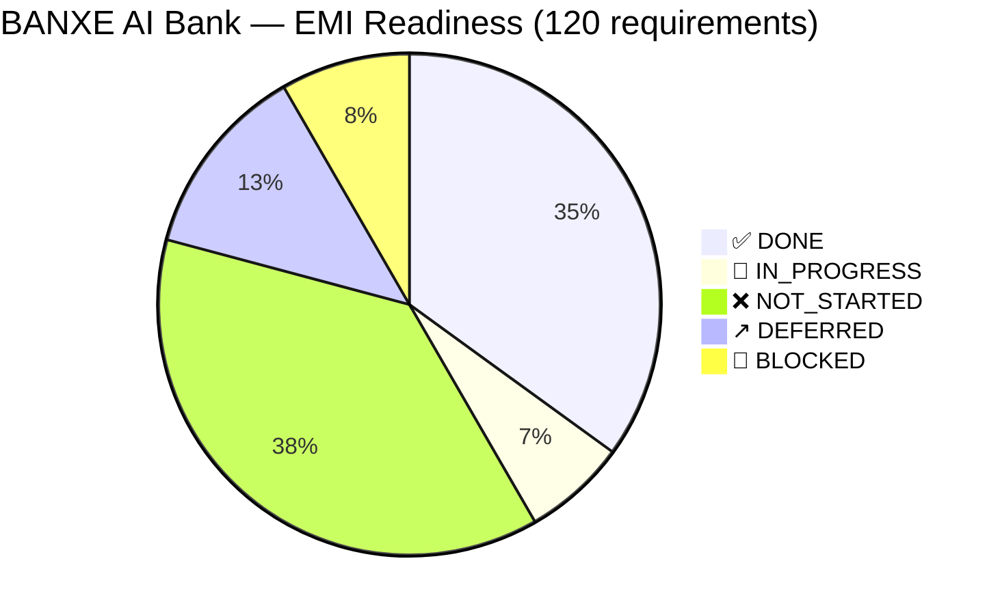
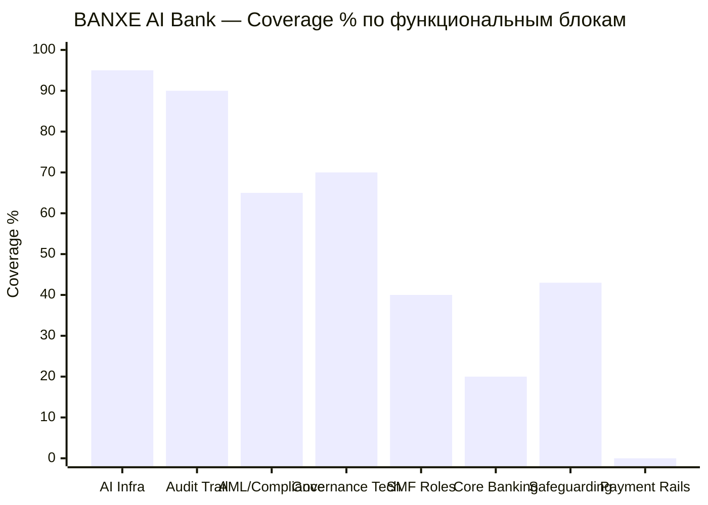
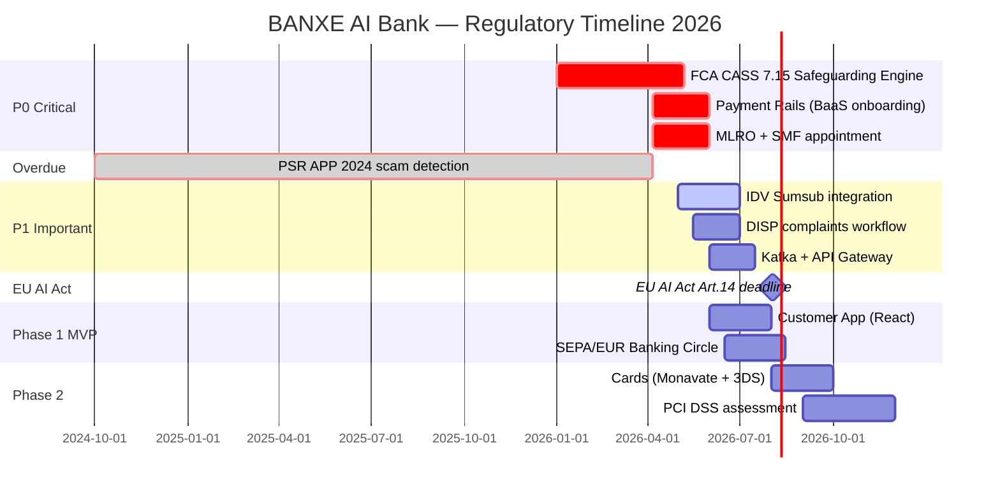
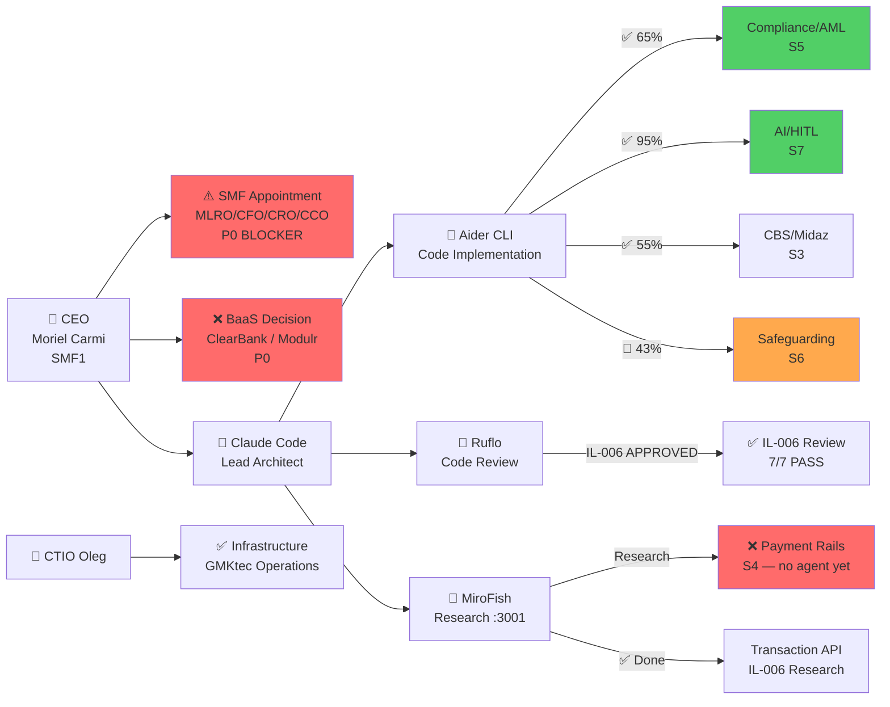

# Compliance Heatmap — BANXE AI Bank
# IL-008 | 2026-04-06

## 1. Pie Chart — Distribution по статусу (из 120+ requirements)



---

## 2. Block Heatmap — 15 разделов Master Doc

```mermaid
block-beta
  columns 3

  block:governance["S1 Governance\n40% 🟡"]:1
  block:geniusto["S2 Geniusto→замена\n100% 🟢"]:1
  block:cbs["S3 CBS/Midaz\n55% 🟡"]:1

  block:payments["S4 Payment Rails\n0% 🔴\n❌ CRITICAL"]:1
  block:compliance["S5 Compliance/AML\n65% 🟡"]:1
  block:safeguarding["S6 Safeguarding\n43% 🟠\n⏰ 7 May 2026"]:1

  block:ai["S7 AI & HITL\n95% 🟢"]:1
  block:infra["S8 Infrastructure\n59% 🟡"]:1
  block:emiready["S9 EMI Readiness\n35% 🔴"]:1

  block:components["S10 Components\n50% 🟡"]:1
  block:layers["S11 Layers\n50% 🟡"]:1
  block:gaps["S12 Gap Analysis\n100% 🟢"]:1

  block:govmech["S13 Governance\n65% 🟡"]:1
  block:roadmap["S14 Roadmap\n44% 🟡"]:1
  block:deadlines["S15 Deadlines\ntracked 🟡"]:1
```

---

## 3. Coverage Bar Chart по функциональным блокам



---

## 4. Critical Timeline — Регуляторные дедлайны



---

## 5. Agent Distribution — кто за что отвечает



---

## 6. Честная оценка: Banxe AI Bank vs Industry Standard

| Область | Banxe | Industry Startup | Зрелый EMI |
|---------|-------|-----------------|-----------|
| AI/HITL governance | 🟢 95% | 🔴 10% | 🟡 40% |
| AML/Compliance | 🟡 65% | 🟡 50% | 🟢 80% |
| Core Banking | 🔴 20% | 🟢 80% | 🟢 95% |
| Payment Rails | 🔴 0% | 🟢 70% | 🟢 100% |
| Safeguarding | 🟠 43% | 🟡 30% | 🟢 90% |
| **Overall** | **35%** | **55%** | **90%** |

**Стратегический вывод:**
Banxe построен "снаружи внутрь" — compliance-мозг первым (дифференциатор),
операционное тело через BaaS (commodity). Подход обоснован для AI-first EMI.
Критический риск: 7 May 2026 CASS 7.15 deadline при 43% safeguarding coverage.

*IL-008 | 2026-04-06*
