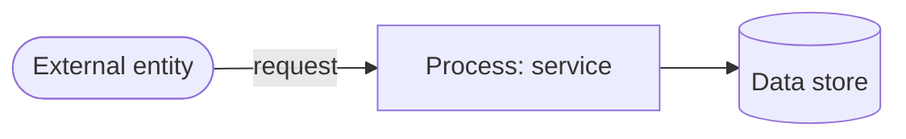

# Threat Model — `<service-name>` (STRIDE)

> **SCAFFOLD — TEMPLATE (not a real threat model).** Sprint S2 DevSecOps/SSDLC.
> Copy this file to `docs/governance/threat-models/<service>.md` and fill it in.
> Per-service instances and sign-off owners **AWAIT OPERATOR**.
> Anchor: `docs/governance/DEVSECOPS-SSDLC.md` §6 (Threat modeling process).

---

## 0. Metadata

| Field | Value |
|-------|-------|
| Service | `<service-name>` |
| Owner | AWAITS OPERATOR |
| Trust zone | 🔴 RED / 🟡 AMBER / 🟢 GREEN (`.claude/rules` zone canon) |
| Perimeter | Project cluster evo1/evo2 (regulated) / Factory Legion (no customer data) |
| Reviewed by | AWAITS OPERATOR (Ruflo mandatory if payment/compliance/kyc) |
| Date | AWAITS OPERATOR |

## 1. System overview

- **Purpose:** _<what the service does>_
- **Data classification:** _<PII / KYC / AML / payment / none>_
- **Inference:** if AI is used, it MUST run on-prem (evo1/evo2) — hard rule, `docs/compliance/ai-data-flow.md` line 19.

## 2. Data-flow diagram

_Insert a Mermaid `flowchart` of external entities, processes, data stores, and trust boundaries. (CI validates Mermaid — keep it valid.)_

## 3. Trust boundaries & assumptions

- Regulated data stays on evo1/evo2; no customer data on the factory (ADR-117).
- Secrets only in `/data/banxe/.env` on evo1 (`DEPLOYMENT-ARCHITECTURE.md` line 296); none in repo (ADR-103 Part 1).

## 4. STRIDE analysis

| STRIDE category | Threat | Affected element | Likelihood | Impact | Mitigation / control | Status |
|-----------------|--------|------------------|------------|--------|----------------------|--------|
| **S**poofing | | | | | | OPEN |
| **T**ampering | | | | | | OPEN |
| **R**epudiation | | | | | | OPEN |
| **I**nformation disclosure | | | | | | OPEN |
| **D**enial of service | | | | | | OPEN |
| **E**levation of privilege | | | | | | OPEN |

## 5. Residual risk & sign-off

| Risk | Owner | Accepted by | Date |
|------|-------|-------------|------|
| | AWAITS OPERATOR | AWAITS OPERATOR | AWAITS OPERATOR |

> For payment/compliance/kyc services, sign-off requires the compliance chain
> (Ruflo mandatory middleware; `.claude/rules/agents.md`) and, for HIGH risk,
> the MLRO gate (`software-factory-canon-v1.md` §8.3).
